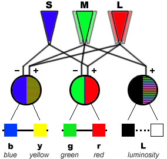
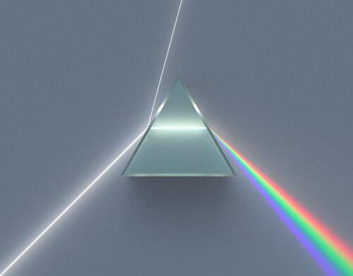

Trong bài trước, chúng ta đã đi qua khái niệm ánh sáng như một hiện tượng vật lý (ánh sáng khả kiến, biểu đồ CIE 1931, cân bằng trắng). Trong bài này sẽ chuyển hướng sang màu sắc, tức cảm nhận của não bộ.

## Tại sao lại có màu sắc?

Như đã nói, do các tế bào nón nhạy với một số bước sóng nhất định nên khi ánh sáng đi vào mắt, chúng sẽ phản ứng với các bước sóng đó. Và não bộ sẽ cảm nhận được màu sắc. Nhưng làm thế nào mà chúng ta biết được dải bước sóng đó như thế nào?

Quay lại tầm thập niên 1670, nhà vật lý [Isaac Newton](https://en.wikipedia.org/wiki/Isaac_Newton) đã thực hiện một thí nghiệm tán xạ ánh sáng bằng cách chiếu một chùm ánh sáng xuyên qua một lăng kính, ánh sáng bị tán xạ thành dài màu sắc.

Tuy nhiên, bản thân cầu vồng này không bao gồm tất cả các màu não người thấy được. Ta có `magenta`: một màu pha trộn giữa đỏ và xanh dương, không xuất hiện trong dải quang phổ đơn sắc của thấu kính. Nghĩa là không có bước sóng đơn nào tạo ra magenta - nó chỉ có mặt khi não kết hợp tín hiệu kích thích đồng thời của tế bào nón `L` _(phản ứng nhiều với màu đỏ)_ và `S` _(phản ứng nhiều với màu xanh dương)_.

## Tham khảo

- David Heeger, [Perception Lecture Notes: Color](https://www.cns.nyu.edu/~david/courses/perception/lecturenotes/color/color.html)
- Bruce MacEvoy, [The Geometry of Color Perception](https://www.handprint.com/HP/WCL/color2.html)
- Nguyễn Đình Đăng, [Bí mật của màu sắc](https://nguyendinhdang.wordpress.com/2013/05/16/bi-mat-cua-mau-sac/)
