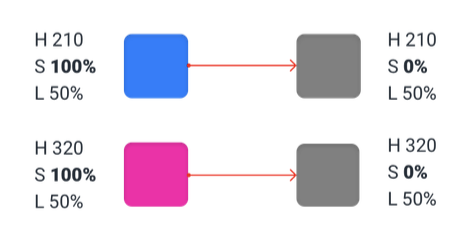

Chắc hẳn khi code, các bạn sẽ gặp các mã màu ở dạng `RGB`, `HEX`. Tuy nhiên, có bao giờ bạn thắc mắc tại sao nó có thể biểu diễn được màu gì, sáng/tối ra sao không?

## RGB và HEX

Đầu tiên hãy nói về `RGB` và `HEX`, về cơ bản thì nó cùng biểu diễn 3 giá trị là `Red - Green - Blue`.
- Với `RGB` thì biểu diễn ở `rgb(<RED_VALUE>, <GREEN_VALUE>, <BLUE_VALUE>)`, với giá trị từng kênh từ `0` đến `255` ở hệ thập phân (Decimal). VD: `rgb(247, 202, 201)`, `rgb(146, 168, 209)`.
- Với `HEX` thì biểu diễn ở `#<RED_VALUE><GREEN_VALUE><BLUE_VALUE>` với giá trị từng kênh từ `0` đến `255` ở hệ thập lục phân (Hexadecimal). Tổng là 6 kí tự, chưa tính `#`. VD: `#F7CAC9`, `#92A8D1`.

Sau này mở rộng hơn, người ta sẽ có thêm kênh `Alpha` để thể hiện độ mờ/trong (transparent/opacity) của một màu. Nó sẽ có lần lượt là `RGBA`, `HEX with Alpha`.
- Với `RGBA` được biểu diễn như sau `rgba(247, 202, 201, 0.9)`. Với kênh `Alpha` giá trị từ `0.00` đến `1.00` ở hệ thập phân.
- Với `HEX with Alpha` được biểu diễn như sau `#F7CAC90A`, với kênh `Alpha` giá trị từ `0` đến `255` ở hệ thập lục phân. Tổng là 8 kí tự, chưa tính `#`.

HEX kèm kênh Alpha ít khi được sử dụng. Mình cũng chỉ mới biết gần đây khi chuyển giá trị từ file JSON của [Tokens Studio](https://tokens.studio) sang CSS Variables thông qua [style-dictionary](https://amzn.github.io/style-dictionary/#/).

Kênh Alpha ở đây cũng chỉ thể hiện giá trị `0%` đến `100%` ở dạng thập lục phân. Bạn có thẻ tham khảo bảng quy đổi từ hệ thập phân sang thập lục phân ở [đây](https://stackoverflow.com/a/25170174).

## HSL

Đồng ý là `RGB` và `HEX` là những mã màu phổ biến, tuy nhiên vẫn khó giải thích sự liên quan giữa các sắc thái trong một dải màu.

Như trường hợp này, mình không biết người ta chọn tâm linh thế nào được dải màu như vậy. Hay là người ta phải dùng code để tạo ra một dải màu gồm 10 phần tử rồi chọn. Sau đó rồi điều chỉnh một cách tâm linh? Bạn có thể coi qua phần [Shade và Tint](/tutorials/apexcharts-va-monochrome/#shade-v%C3%A0-tint) của bài viết này.

Tuy nhiên, nếu ta đổi sang mã `HSL` với giá trị lần lượt là `Hue`, `Saturation`, `Lightness` sẽ dễ hiểu hơn nhiều.

### Các thành phần trong HSL

#### Hue

`Hue` là giá trị của màu sắc dựa trên vị trí trên vòng tròn màu. Màu đỏ ở vị trí `0°`, màu xanh lá ở vị trí `120°` và màu xanh dương ở vị trí `240°`.

Màu `Trắng`, `Đen`, `Xám` không được xem là `Hue`.

#### Saturation

`Saturation` được hiểu là độ bão hòa màu, nó giống như thể hiện độ rực rỡ. Giá trị từ `0%` đến `100%`. Giá trị `0%` thì trở thành xám, có thể hiểu là bay màu. Giá trị `100%` thì màu trở nên rực rỡ, sống động nhất.

Lưu ý, khi giá trị của Saturation về `0%` thì nó không thay đổi màu sắc như `Hue`.

#### Lightness

`Lightness` được hiểu là thước đo chuyển từ đen sang trắng. Giá trị từ `0%` cho màu đen tuyệt đối, và `100%` là cho màu trắng. Với giá trị `50%` là cho ra màu tự nhiên của một màu sắc nhất định (màu thực của `Hue`).

### HSL và HSB

- `HSL` là `Hue`, `Saturation`, `Lightness`.
- `HSB` là `Hue`, `Saturation`, `Bightness`.

Nếu dịch từ tiếng Anh sang, `lightness` và `brightness` có thể hiểu liên quan tới độ sáng. 

Hiểu theo vật lý, `lightness` hiểu là độ phản xạ ánh sáng, với màu đen là 0.3%, màu trắng là 90%. Do đó, với `lightness`, vật không phản xạ lại ánh sáng thì ta nhìn thấy màu đen (không có ánh sáng phản xạ). Phản xạ ánh sáng nhiều quá sẽ nhìn ra màu trắng, giống như ta chiếu đèn quá sáng thì thấy màu trắng.

Còn `brightness` là độ chói. Tức là cường độ ánh sáng mà mắt người có thể nhìn thấy. Hiểu theo cách khác, là từ không nhìn thấy được (màu đen) cho tới khi nhìn thấy được (thấy tới màu thực của một sắc độ bất kỳ). Khi quy về máy tính, cùng một sắc độ (Hue) với độ bão hòa (Saturation) 100% thì `brightness 100%` chỉ tương đương `lightness 50%`.

Trong các phần mềm phổ biến, ví dụ như Color Picker thì ứng dụng của `HSB` phổ biến hơn do trực quan hơn. Nhưng để thể hiện giá trị cho các thiết bị nhìn thì ta lại dùng `HSL`.

## Thay đổi độ sáng bằng Hue

Chúng ta có thể làm sáng hơn bằng cách xoay `Hue` trong khoảng `—60°`, `180°`, hoặc `300°`. Ngược lại để tối hơn, ta có thể xoay `—0°`, `120°`, hoặc `240°`.

Mấy ní coi thêm bài viết này nha [How to make your own color palettes](https://medium.com/@greggunn/how-to-make-your-own-color-palettes-712959fbf021).

## Tham khảo

- Refactoring UI, [Ditch hex for HSL](https://www.refactoringui.com/)
- Keyframe, [Phân Biệt Color - Hue - Tint - Shade - Tone](https://keyframe.vn/bai-viet/phan-biet-color-hue-tint-shade-tone-50.html)
- Changing Minds, [Lightness, Luminosity, Luminance and Other Tonal Descriptors
](https://changingminds.org/explanations/perception/visual/lightness_variants.htm)
- Alan L. Gilchrist, [Lightness and brightness](https://www.cell.com/current-biology/pdf/S0960-9822(07)00878-0.pdf)
- Greg Gunn, [How to make your own color palettes](https://medium.com/@greggunn/how-to-make-your-own-color-palettes-712959fbf021)