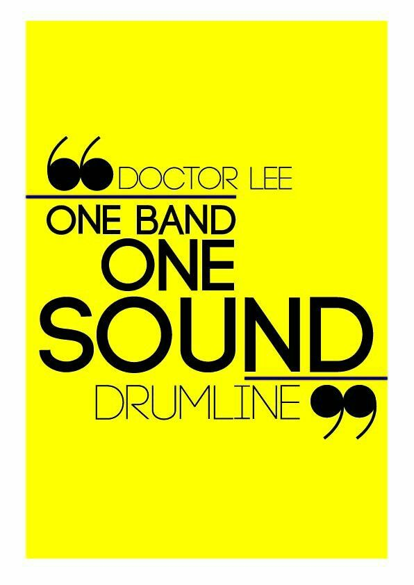

Đó là câu nói của thầy dạy nhạc vài năm trước, khi kiểm điểm lại thái độ làm việc của cả đội Nghi Lễ. Lớn dần, chuyển sang một công việc phải làm việc tập thể thì câu nói ấy vẫn đúng. Mình viết không phải để cho mình đọc, mà để cho đồng nghiệp của mình.

## Coding Convention

Coding convention, coding standard, coding guideline,... mấy thứ này cùng nói về một bộ quy tắc chung, được đúc kết trong quá trình làm việc để mọi người tuân thủ nhằm nâng cao chất lượng code.

Vấn đề này, các bạn có thể tìm hiểu định nghĩa ở trên Google, mình chỉ tổng hợp lại một số nguồn để tham khảo quy tắc trong quá trình phát triển phần mềm.

Nếu lười thì bạn có thể xem tại đây: [Why Coding Standards Matter](https://blog.fossasia.org/why-coding-standards-matter/).

## Một số vấn đề

> All code in any code-base should look like a single person typed it, no matter how many people contributed.

### Về Design

- UX Pin, [Creating a Design System: The Step-by-Step Guide](https://www.uxpin.com/create-design-system-guide)
- Invision App, [A comprehensive guide to design systems](https://www.invisionapp.com/inside-design/guide-to-design-systems/)
- Brad Frost, [Atomic Design](http://bradfrost.com/blog/post/atomic-web-design/)

### Về Front-End

- HTML, CSS: [http://codeguide.co/](http://codeguide.co/)
- JavaScript
  - Standard JS, [JavaScript Standard Style](https://standardjs.com/rules.html#javascript-standard-style).
  - Airbnb, [JavaScript Style Guide](https://github.com/airbnb/javascript)
  - Google, [Google JavaScript Style Guide](https://google.github.io/styleguide/jsguide.html)
- React
  - CSS Tricks, [React Code Style Guide](https://css-tricks.com/react-code-style-guide/)
  - React Patterns, [React Patterns](https://reactpatterns.com/)
- Vue
  - Vue.js, [Style Guide](https://vuejs.org/v2/style-guide/)
  - Pablo Henrique, [Vue.js Component Style Guide](https://github.com/pablohpsilva/vuejs-component-style-guide)

### Về REST API

- Atlassian, [Atlassian REST API design guidelines version 1](https://developer.atlassian.com/server/framework/atlassian-sdk/atlassian-rest-api-design-guidelines-version-1/)
- Microsoft Azure, [API Design](https://docs.microsoft.com/en-us/azure/architecture/best-practices/api-design)
- IBM, [REST API conventions](https://www.ibm.com/support/knowledgecenter/en/SS4GCC_6.1.1/com.ibm.urelease.doc/topics/rest_api_ref_conventions.html)
- Stoney Cloud, [Category:REST API](http://wiki.stoney-cloud.org/wiki/Category:REST_API)
- Zalando, [Zalando RESTful API and Event Scheme Guidelines](https://opensource.zalando.com/restful-api-guidelines/)
- REST API Tutorial, [REST API Tutorial](https://restfulapi.net/)

### Về Microservices

- Martin Fowler, [Microservices Resource Guide](https://www.martinfowler.com/microservices/)
- Chris Richardson, [Microservice Architecture](https://microservices.io/patterns/microservices.html)
- Microsoft Azure, [Microservices architecture style](https://docs.microsoft.com/en-us/azure/architecture/guide/architecture-styles/microservices)

### Về Git

- Microsoft Azure, [Adopt a Git branching strategy](https://docs.microsoft.com/en-us/azure/devops/repos/git/git-branching-guidance?view=azure-devops)
- Conventional Commits, [Conventional Commits](https://www.conventionalcommits.org/en/v1.0.0-beta.2/#specification)
- Karma, [Git Commit Msg](http://karma-runner.github.io/3.0/dev/git-commit-msg.html)
- Git Branching, [Git/GitHub branching standards & conventions](https://gist.github.com/digitaljhelms/4287848)

### Về bảo mật

- OWASP, [OWASP SCP Quick Reference Guide v2](https://www.owasp.org/index.php/File:OWASP_SCP_Quick_Reference_Guide_v2.pdf)

## Thực tế khi áp dụng

Về coding, mình sử dụng [Pretter](https://prettier.io/) tích hợp với [Visual Studio Code](https://code.visualstudio.com/) để format lại code nên không quan trọng lắm guideline về cú pháp. Còn lại phải đọc tài liệu để cải thiện kỹ năng. Ngoài ra, bạn có thể sử dụng các công cụ Linter để kiểm tra code trước khi đẩy lên source control. [ESLint](https://eslint.org/) là một ví dụ.

Về Git, mình dùng [Commitizen](https://github.com/commitizen/cz-cli) để tự động nhắc nhở mình phải viết Git Message sao cho chuẩn. Nó cũng có extension tích hợp vào VSCode.

## Nên đọc sách gì

Guideline chỉ là quy tắc của một tổ chức để thống nhất với nhau, không nên quá đặt nặng. Có ý thức là được rồi. Tổng quát thì các bạn có thể tham khảo thêm 2 cuốn này để nắm tinh hoa của nó.

- Robert C. Martin, [Clean Code: A Handbook of Agile Software Craftsmanship](https://www.amazon.com/Clean-Code-Handbook-Software-Craftsmanship/dp/0132350882)
- Martin Fowler, [Refactoring: Improving the Design of Existing Code](https://www.amazon.com/Refactoring-Improving-Design-Existing-Code/dp/0201485672/ref=sr_1_3?s=books&ie=UTF8&qid=1549539639&sr=1-3&keywords=refactoring)
