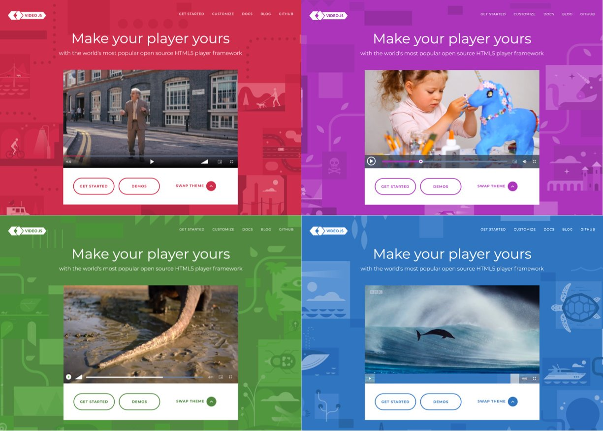

Mình đang làm một dự án có sử dụng Video.js để phát video. Ở đây, mình dùng Google Tag Manager để lưu vết sự kiện. Tuy nhiên, có một số sự kiện sẽ kéo theo liên tục nếu các bạn chỉ chăm chăm vào track sự kiện mặc định của Video.js.

## Sơ lược về Video.js

Các bạn có thể sử dụng thẻ `<video>` mặc định của HTML5. Tuy nhiên sẽ có một số nhược điểm sau, theo như trên [trang chủ](https://videojs.com/) của Video.js.

- Có thể can thiệp giao diện bằng CSS, thay vì hiển thị khác nhau trên từng trình duyệt.
- Hỗ trợ [HLS](https://en.wikipedia.org/wiki/HTTP_Live_Streaming) và [DASH](https://dashif.org/). Các bạn có thể tìm hiểu thêm qua bài viết [MPEG-DASH vs. HLS: What You Should Know Before Your Next Live Stream Event](https://www.dacast.com/blog/mpeg-dash-vs-hls-what-you-should-know/).
- Hỗ trợ chơi YouTube, Vimeo và nhiều nền tảng khác thông qua plugin.

## Vấn đề đặt ra

Một số sự kiện mình cần phải track như:

- Play
- Pause
- Resume
- Seek
- Ended

### Những sự kiện cơ bản

Cứ bình tĩnh mà track:

- Play
- Pause
- Resume

### Seek

Sự kiện **Seek** chính là hành động người dùng muốn tua đến một đoạn khác. Sự kiện này gồm một chuỗi các sự kiện sau:

- Pause
- Seeking
- Play
- Seeked

Mục đích của việc track sự kiện Seek là biết được người dùng tua đến thời gian bao nhiêu của đoạn clip, nên ta cứ đặt ở sự kiện `Ended`. Có một điểm là các bạn sẽ thấy có sự kiện `Pause` và làm sao để vô hiệu hoá nó trong hành động này? Để ý một tí, các thap tác trên giao diện lần lượt là:

- Di chuyển chuột đến thanh hiển thị thời gian đang chạy
- Click vào điểm muốn tua
- Video tạm dừng để chờ load phần cần tua đến
- Video phát trở lại

Mấu chốt là phải click vào thời điểm mình muốn tua đến. Thanh đó gọi là **SeekBar**. Vậy mình chỉ cần lắng nghe sự kiện `click` của SeekBar là được.

### Ended

Chuỗi sự kiện của nó gồm:

- Pause
- Ended

Nhìn vậy chứ cũng dễ, ở sự kiện `Pause` bạn kiểm tra xem phim đã hết chưa. Hết rồi thì bỏ qua sự kiện này đi.
