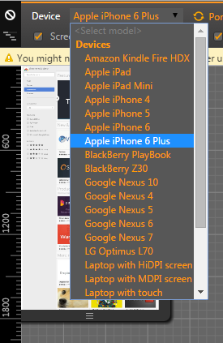

Nhớ lại cái thời mới tập tành làm Web hồi tháng 4 năm 2014, lúc đó mình chỉ biết mỗi Google Chrome. Qua một thời gian dài làm việc, mình muốn chia sẻ với các bạn nên sử dụng khi làm front-end.

## Front-end là gì?

Mình xin mượn định nghĩa của anh [Phạm Huy Hoàng](https://toidicodedao.wordpress.com/about/) - tác giả của trang [Tôi đi code dạo](https://toidicodedao.wordpress.com): **"Front-end là những gì người dùng nhìn thấy và tương tác. Nó là “mặt tiền” của một trang web"**.

## Luận bàn về các trình duyệt

Mình không có điều kiện, nên xài máy sử dụng hệ điều hành Microsoft Windows. Lúc mình viết bài này, Windows 10 đã ra, nhưng nó chưa hỗ trợ tốt cho công việc nên mình vẫn còn sử dụng Windows 7. Một thời gian sau (thời điểm cập nhật phần Microsoft Edge), mình đã chuyển lên Windows 10 và có thể viết review về nó.

### Google Chrome

Trình duyệt này mình sử dụng từ hồi mới làm Web. [Google Chrome](https://en.wikipedia.org/wiki/Google_Chrome) hỗ trợ đầy đủ các như cầu cơ bản như là kiểm tra Element (Elements), kiểm tra gởi/nhận request (Network), thao tác bằng JavaScript (Console), kiểm tra tài nguyên (Resources),...

Ngoài ra, Google Chrome còn sử dụng nền tảng [V8 JavaScript Engine](<https://en.wikipedia.org/wiki/V8_(JavaScript_engine)>) nên cũng tạo được một sự yên tâm hơn khi chạy JavaScript. Phần layout, Google Chrome sử dụng [Webkit Layout Engine](https://en.wikipedia.org/wiki/WebKit) nên nhiều khi bạn sử dụng CSS có thêm prefix `-webkit-` trước một vài thuộc tính như là `border-radius`, `transition`,...

Mình thích ở Google Chrome là **Device Mode**, hỗ trợ một loạt các thông số của một số thiết bị phổ biến như Apple iPhone, Google Nexus, Samsung Galaxy,... và hỗ trợ quản lý [Web Storage](http://www.w3.org/TR/webstorage/) dễ sử dụng.

Để biết rõ hơn, bạn có thể tham khảo bài viết này:

- [Sự “bá đạo” của Chrome Developer Tools – Phần 1](https://toidicodedao.wordpress.com/2015/10/08/su-ba-dao-cua-chrome-developer-tools-phan-1/)
- [Sự “bá đạo” của Chrome Developer Tools – Phần 2](https://toidicodedao.wordpress.com/2015/10/13/su-ba-dao-cua-chrome-developer-tools-phan-2/)

#### Cập nhật ngày 11/07/2016

Ở thời điểm hiện tại, nó đã đổi tên thành **Device Toolbar**. Cách thiết kế nó cũng tương tự [Google Resizer](http://design.google.com/resizer/).

### Mozilla Firefox Developer Edition

[Mozilla Firefox Developer Edition](https://www.mozilla.org/en-US/firefox/developer/) là trình duyệt mình thích nhất, vì sử dụng theme màu đen, thích hợp cho việc code vào ban đêm và nhìn rất "ngầu".

Về chức năng cơ bản thì vẫn như Google Chrome và hỗ trợ nhiều hơn nữa như **Web Audio**, **Canvas**, **Shader Editor**,... nhưng điểm mình thích nhất vẫn là **Responsive Design Mode**.

**Responsive Design Mode** của Firefox Developer Edition dễ dàng chuyển sang chế độ responsive hơn **Device Mode** của Google Chrome. Do đó, khi làm Web, mình thường dùng FF DevEdition khi làm việc hơn là Chrome.

Mozilla FireFox nói chung, đều sử dụng [Tamarin JavaScript Engine](<https://en.wikipedia.org/wiki/Tamarin_(software)>) và [Gecko Layout Engine](<https://en.wikipedia.org/wiki/Gecko_(software)>). Khi làm việc với CSS trên FF, bạn sẽ thấy prefix là `-moz-` và `-mo-`.

Để biết rõ hơn, bạn có thể tham khảo bài viết này:

- [Sử dụng Firefox Developer Edition cho việc phát triển Web](http://code.tutsplus.com/vi/tutorials/using-firefox-developer-edition-for-web-development--cms-23793)

#### Cập nhật ngày 11/07/2016

Trong dự án gần đây nhất, mình có bị một lỗi xử lý ở trên Server. Trong quá trình debug, mình chắc chắn Action đó sẽ phải trả ra Exception. Có một điều bất ngờ, trong Task Manager có một Service tên là "**Plugin Container for FirefoxDeveloperEdition (32 bit)**" sử dụng RAM rất nhiều và không trả Exception. Nó cứ quay đều. Bị vài lần, mình thấy lạ lạ. Sau khi tìm hiểu được nguyên nhân, mình mới biết là mỗi lần nó bắt đầu quay là biết phía Server đang có Exception xảy ra, lo mà tắt cái service đó đi, kẻo nó restart máy.

Với lỗi khỉ gió này, Firefox bản bình thường (màu đỏ) cũng bị lỗi tương tự.

### Opera

[Opera](http://www.opera.com) sử dụng [Blink Layout Engine](<https://en.wikipedia.org/wiki/Blink_(web_engine)>) và [V8 JavaScript Engine](<https://en.wikipedia.org/wiki/V8_(JavaScript_engine)>). Cơ bản thì Opera chả khác gì so với Google Chrome, nhưng khi làm CSS thì để ý prefix `-o-`.

Mình thì cũng chả hứng thú gì với em này, được cái là nó đỡ ngốn RAM hơn Google Chrome.

### Microsoft Internet Explorer 11

[Microsoft Internet Explorer](https://en.wikipedia.org/wiki/Internet_Explorer) là một ác mộng đối với những người làm Front-End. Cơ bản thì từ những phiên bản IE8 về trước hỗ trợ JavaScript còn cùi bắp, có thể nói là "Big Zero". Lên tí, IE8 là bỏ xó được rồi. Kể từ IE9 trở lên, có một số cải thiện về mặt chuẩn mực hơn. Riêng mình bàn tới IE11 là vì nó có thể giúp bạn chọn chế độ IE7, IE8,... và IE11.

IE11 nó có một điều hơi lạ thế này là **not responding** theo từng tab. Có một điểm mạnh mà chỉ có IE mới làm được là can thiệp được hệ thống (Windows). Chẳng hạn, detect được bạn đang sử dụng múi giờ nào trên hệ điều hành. Các trình duyệt khác thì không làm được.

Hiện tại thì Microsoft đã khai tử bé này và thay thế bằng [Microsoft Edge](https://en.wikipedia.org/wiki/Microsoft_Edge) và chỉ chạy được trên Windows 10, không có bản cài đặt standalone.

### Apple Safari

[Apple Safari](<https://en.wikipedia.org/wiki/Safari_(web_browser)>) là một trình duyệt dành cho hệ điều hành Mac OS X của hãng Apple. Tin buồn là Apple đã không còn hỗ trợ cho phiên bản trên Windows vào năm 2012. Phiên bản cuối cùng được phát hành là Safari 5.1.7 vào ngày 9 tháng 5 năm 2012. Bạn có thể tham khảo bài viết [Safari version history](https://en.wikipedia.org/wiki/Safari_version_history) để tìm hiểu.

Làm việc với bản Safari 5.1.7 trên Windows cũng vui. Vì giao diện của bạn đẹp lung linh trên các trình duyệt khác thì Safari sẽ làm bạn thất vọng tràn trề. Nhưng đừng nản, cứ search Google, thêm một số prefix là sẽ hiển thị được thôi.

### Microsoft Edge

[Microsoft Edge](https://en.wikipedia.org/wiki/Microsoft_Edge) là phiên bản trình duyệt nhằm thay thế Internet Explorer và chỉ chạy được trên Windows 10 (thời điểm hiện tại).

Theo mình, Microsoft Edge có chức năng gần giống Internet Explorer. Microsoft đã thêm một số thứ mới vài Edge như là có thể mở web chạy từ `localhost` (IE thì không nhận), lưu trang Web dưới dạng PDF,... Nhưng cũng có một số khó khăn đó là không hỗ trợ lưu trang Web dưới dạng HTML như IE, khi F12 thì phần Developer Tools mặc định sẽ tạo một cửa sổ mới (thích hợp với làm việc từ 2 màn hình trở lên, nhưng khó khăn với 1 màn hình), giao diện hơi khó thao tác.

### Cốc Cốc

Tại sao lại có Cốc Cốc ở đây nhỉ? Đơn giản là bạn đang ở Việt Nam. Đây là trình duyệt có số lượng người Việt dùng đáng kể và cũng nên kiểm tra kĩ càng trên nó. Dưới đây là thống kế lượng truy cập vào blog của mình trên các trình duyệt, tính tới ngày 11/07/2016.

Quay lại câu chuyện dự án gần đây, không trả Exception trên Firefox thì ở Cốc Cốc, nó vẫn đá Exception bình thường. Google Chrome thì vẫn hên xui. Chả hiểu.

## Kết luận

Những trình duyệt mình nêu trong bài viết này đều được sử dụng khi làm website. Tiêu chí đầu tiên và cũng là bắt buộc khi làm Front-End là phải hiển thị tốt trên tất cả các trình duyệt ([Cross-browser](https://en.wikipedia.org/wiki/Cross-browser)). Bởi vì CSS và JavaScript, mỗi trình duyệt định nghĩa theo một kiểu khác nhau nên có thể Firefox hiểu nhưng Opera không hiểu.

Chẳng hạn như hàm `window.navigate('http://www.google.com')` trong JavaScript chỉ chạy được trên Microsoft Internet Explorer, muốn chạy trên các trình duyệt khác phải sửa thành `window.location.href='http://www.google.com';`.

Còn một điều này khi xài IE và Edge của Microsoft đó là chức năng **Inspect Element**. Mặc định thì nó khi bạn hover vào tag nào đó trong **DOM Explorer** thì nó không highlight ngoài giao diện đâu. Bạn phải làm như hình dưới.

## Tham khảo

- [Những kĩ năng cần có của một web developer](https://toidicodedao.wordpress.com/2015/08/18/nhung-ki-nang-can-co-cua-mot-web-developer/)
- [Vendor Prefix](https://developer.mozilla.org/en-US/docs/Glossary/Vendor_Prefix)
- [What CSS to prefix?](http://shouldiprefix.com)
- [Gặp tí khó khăn khi inspect element trên IE11](http://daynhauhoc.com/t/gap-ti-kho-khan-khi-inspect-element-tren-ie11/11612/2)
