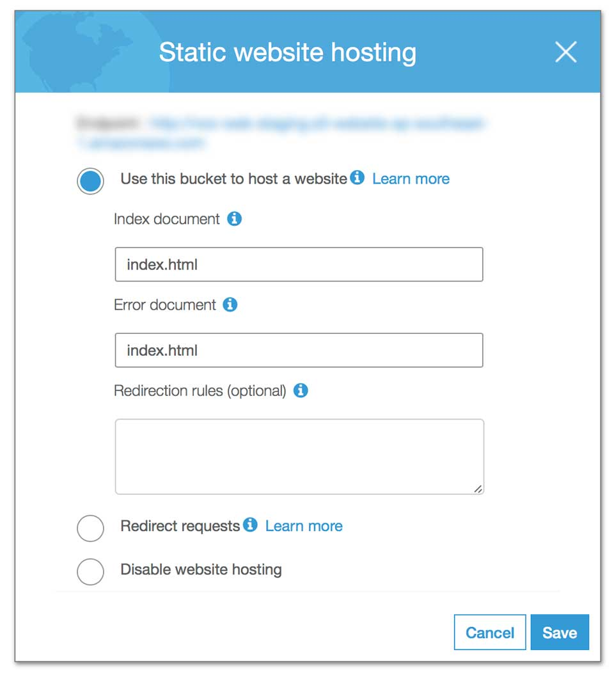

Công việc đầu tiên khi vào công ty mới là làm một ứng dụng với React. Công việc tiếp theo là làm lại blog với React. Và thế là hành ngập mặt bắt đầu từ đây.


## Deploy trên AWS S3

Vì đặc thù công việc, nên mình phải tìm một nơi để chạy demo cho các sếp review. Công ty mình dùng Amazon Web Services (AWS). Công việc chỉ là deploy một static web được tạo bằng **create-react-app**, do đó cũng nghĩ là đẩy source code lên là được.

Ứng dụng này là một single page app, nên mình gõ đường dẫn `http://demo.aws.amazon.com` là vô được. Sau đó thử một đường dẫn khác là `http://demo.aws.amazon.com/another-page` vẫn chạy ngon lành.


Bây giờ, mình nhấn vào một link bất kỳ, em ấy vẫn load được giao diện. Các bạn để ý chỗ mình khoanh đỏ nhé.


Câu chuyện bắt đầu từ đây khi mình nhấn **Enter**, truy cập trực tiếp vào địa chỉ trên.


Ngạc nhiên chưa? Thực tế, đường dẫn này nó phải có dạng `http://demo.aws.amazon.com/#/another-page`. Tức là phải có kí tự `#`. Ở đây, đường dẫn chỉ là JavaScript load nội dung lên và overwrite lại đường dẫn để chúng ta thấy chỉ còn `http://demo.aws.amazon.com/another-page`. Rõ ràng hơn, bạn vào trực tiếp một địa chỉ không hề tồn tại.

Cảm ơn anh [Vũ Nguyễn](https://www.linkedin.com/in/vunguyentuan/) đã hướng dẫn là phải cấu hình Error trên con S3. Cụ thể như sau.



Như đã nói ở trên, do vào trực tiếp thì không tồn tại đường dẫn trên. Chỉnh lại Error để mỗi khi xuất hiện lỗi, tự động quay về trang chủ. Và về được trang chủ, code JavaScript sẽ tự động xử lý URL và load đúng màn hình.

## Ám ảnh mang tên Service Worker

Rất tiếc, chủ đề này mình không có chụp lại ảnh minh hoạ. Mình sẽ cố giải thích rõ ràng. Trước hết, các bạn có thể tham khảo các bài viết dưới đây để tìm hiểu về Service Worker.

- [Introduction to Service Worker](https://support.google.com/partners/answer/7336697?hl=en)
- [JavaScript Service Worker cơ bản](https://kipalog.com/posts/JAVASCRIPT-SERVICE-WORKER-CO-BAN)
- [Giới thiệu về Service Worker](https://viblo.asia/p/gioi-thieu-ve-service-worker-Qbq5QLgXlD8)

Tóm gọn, Service Worker dùng để hỗ trợ bạn truy cập vào trang web, kể cả khi nó offline aka đọc nội dung từ Cache. Và nó cache khá kinh dị.

Và React liên quan gì đến thằng này? Số là khi bạn tạo React App bằng `create-react-app` thì nó đính kèm sẵn một file `registerServiceWorker.js`. Khi bạn cho nó chạy ở chế độ `production` là nó kích hoạt lên. Nếu client chạy file này là nó sẽ cache, không thể update được phiên bản mới nhất của website. Tin tui đi, hổng lừa mấy bạn đâu. Muốn xoá thì phải chỉnh lại Service Worker của trình duyệt và client bình thường hổng có biết vụ này.

```
my-app
├── README.md
├── node_modules
├── package.json
├── .gitignore
├── public
│ ├── favicon.ico
│ ├── index.html
│ └── manifest.json
└── src
├── App.css
├── App.js
├── App.test.js
├── index.css
├── index.js
├── logo.svg
└── registerServiceWorker.js
```

Nói chung cũng cảm ơn anh Product Owner trời đánh thánh đâm, mỗi lần gặp anh là bị sạt nhưng cũng học được từ anh.

> also i notice that u are using serviceworker, for now its fine, when the workflow kick in, potentially need to do more work on it especially since its meant for offline caching, lots of potential security loopholes can be found there making it not OWASP compliant especially if it caches sensitive form information

## Chốt hạ

Có mỗi 2 cái này là mình cay cú khi làm việc với React. Để từ từ xem có gì hay ho sẽ viết tiếp.
