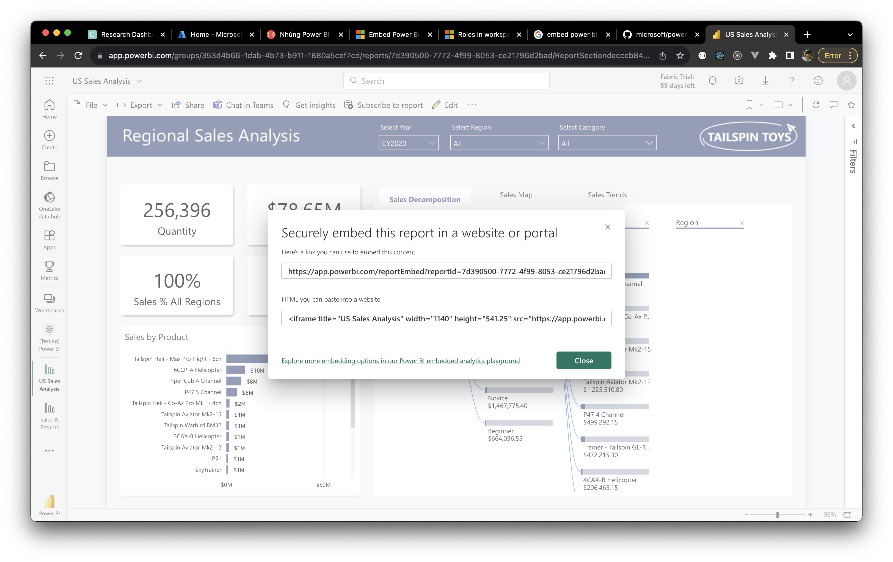

Cứ tưởng mở được popup có chứa link để truy cập trực tiếp và `<iframe>` như vầy là có thể xài được liền. Nhưng không, bạn phải publish nó mới xài được.

Tuy nhiên, yêu cầu ở đây là phải giới hạn lại ai được quyền truy cập nó.

## Tổng quan

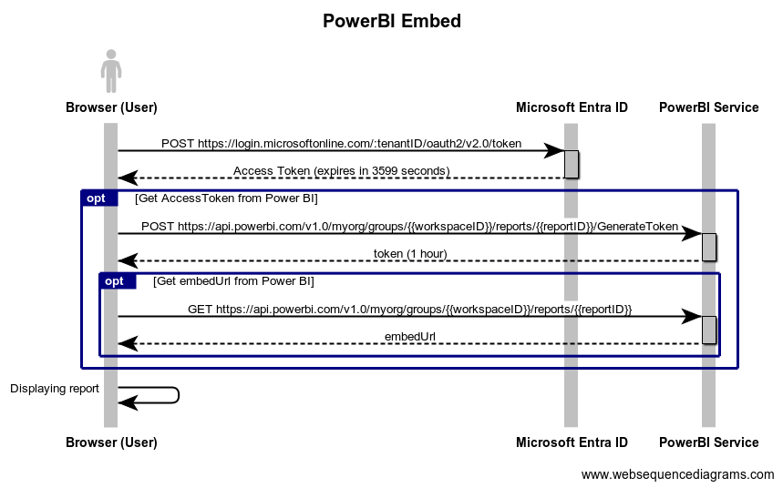

Ở phía User sẽ gọi chuỗi 3 APIs như trên để lấy được `token` và `embedUrl` từ Power BI.

Ở góc nhìn của hệ thống, ta muốn vào trang web là nó sẽ tự gọi API để hiển thị thông tin. Để làm được như vậy, ta cần tạo một `service principal` phía Microsoft Entra ID để nó giao tiếp với Power BI làm điều này.

`Service principal` là một dạng định danh người dùng được phép truy cập tài nguyên. Nó giống như một dạng service được cấp quyền khi bạn không muốn cung cấp credentials và bạn chỉ cần cung cấp permission tối thiểu cho nó là được.

## Cách cấu hình

Sau khi tìm hiểu, chúng ta sẽ cần sử dụng 2 thứ là [Azure Active Directory](https://azure.microsoft.com/en-us/products/active-directory) (sau này là một phần của Microsoft Entra ID) và [Power BI](https://powerbi.microsoft.com/en-us/what-is-power-bi/).

Trình tự cấu hình lần lượt như sau:

1. Tạo Azure AD application, nó sẽ đóng vai trò `service principal`.
2. Bật cấu hình Power BI
3. Cho phép service principal truy cập Power BI
4. Nhúng report vào website

### Tạo Azure AD Application

1. Đăng nhập vào [Azure Portal](https://portal.azure.com/).
2. Tạo Azure AD Application để có `Application (client) ID` và `Directory (tenant) ID`.
   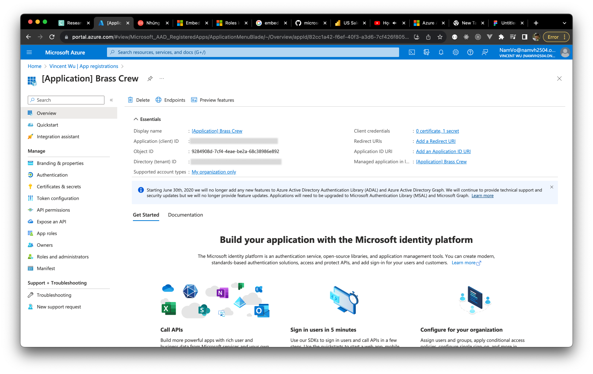
3. Tạo `Client secret`, và lưu ý giá trị chỉ hiện 1 lần duy nhất khi bạn tạo.
   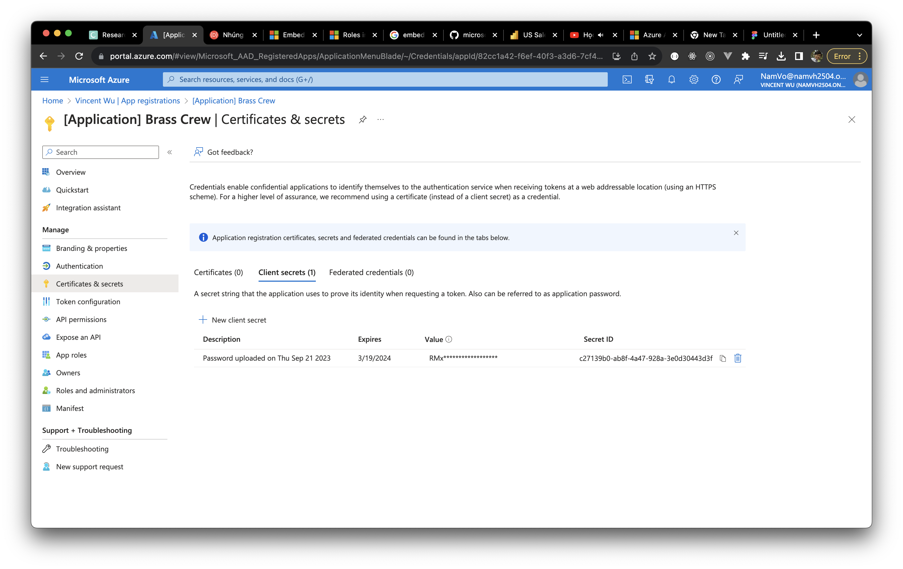

Ở đây, ta không cần cấp thêm bất kỳ quyền nào cho service principal.

> An Azure AD application doesn't require you to configure any delegated permissions or application permissions in the Azure portal when it has been created for a service principal. When you create an Azure AD application for a service principal to access the Power BI REST API, we recommended that you avoid adding permissions. They're never used and can cause errors that are hard to troubleshoot.
>
> -- <cite>Ref: [Embed Power BI content with service principal and an application secret](https://learn.microsoft.com/en-us/power-bi/developer/embedded/embed-service-principal#step-4---add-the-service-principal-to-your-workspace)</cite>

### Bật cấu hình Power BI

1. Truy cập vào [Admin Settings](https://app.powerbi.com/admin-portal/tenantSettings?experience=power-bi).
   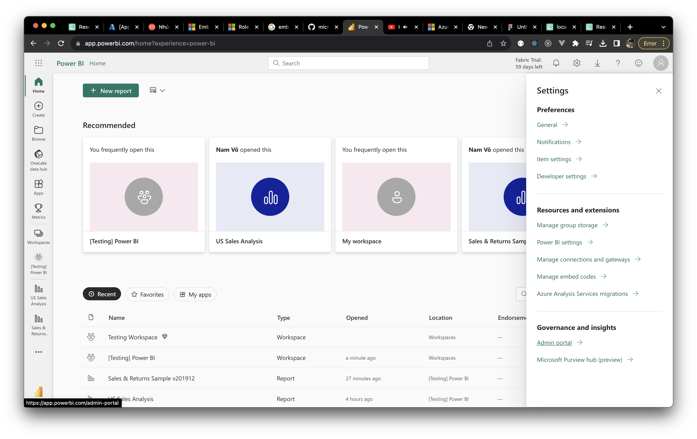
2. Chọn `Enable` ở phần <strong>Embed content in apps</strong>.
   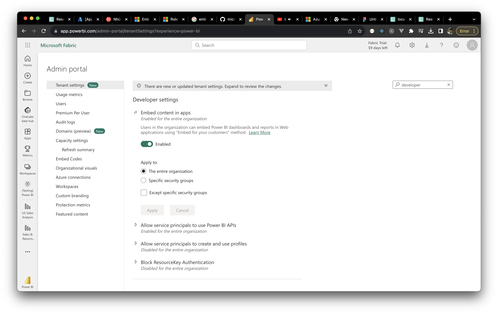
3. Chọn `Enable` ở phần <strong>Allow service principals to use Power BI APIs</strong>, và chọn <strong>Apply to</strong> là `The entire organization`.
   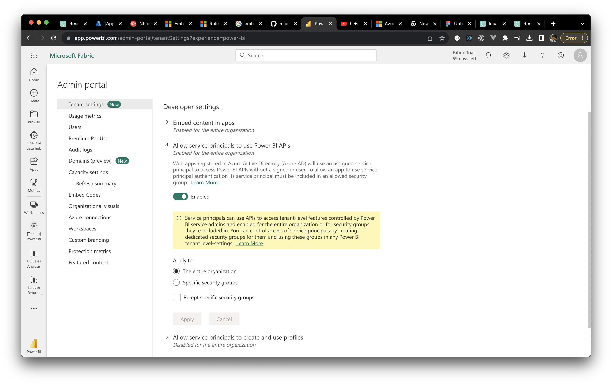

### Cho phép service principal truy cập Power BI

Mở Workspace có chứa report cần hiển thị, vào phần <strong>Manage access</strong> và thêm `service principal` với quyền tối thiểu là `Member` hoặc `Admin`.
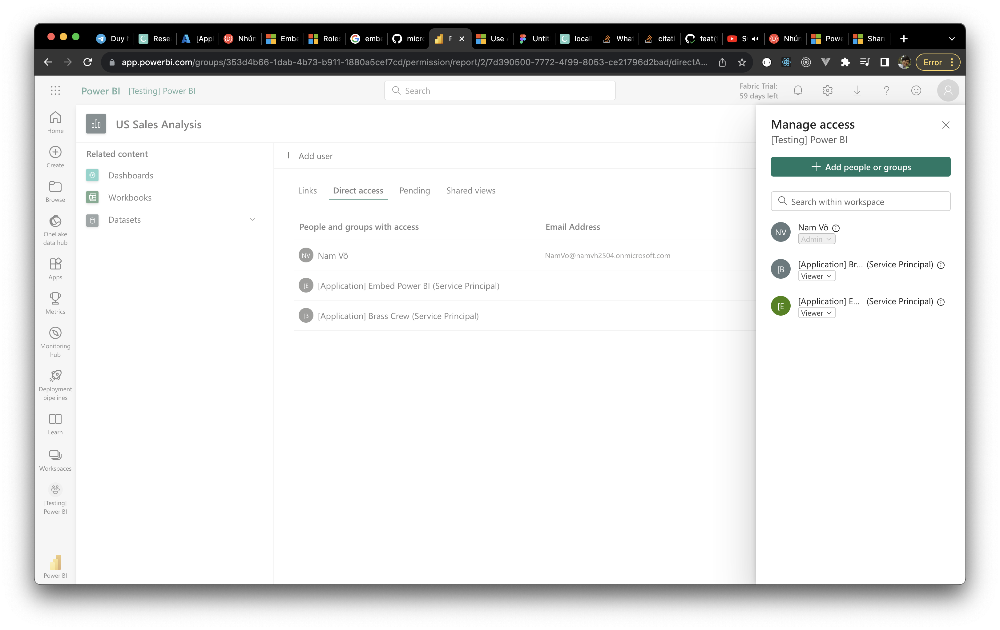

Nếu không thì bạn sẽ nhận được lỗi này khi gọi API Generate Token.

```json
{
  "error": {
    "code": "InvalidRequest",
    "message": "Only folder user with reshare permissions can generate embed token"
  }
}
```

Một điểm nữa, đừng có nghĩ nó báo thư mục user có quyền `reshare` có thể tạo token là mình chuyển sang quyền `Viewer` và cấp thêm quyền `Reshare`.

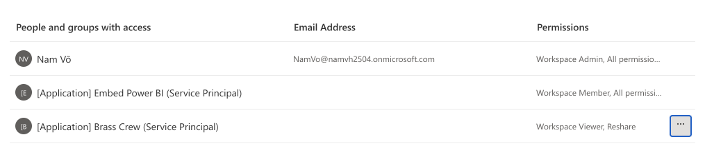

Như vậy vẫn không có tác dụng. Trong document từ Microsoft, họ cũng đã nhắc mở mình rồi, họ bắt buộc phải có quyền của `Admin` hoặc `Member`.

> Your Azure AD app can access your Power BI reports, dashboards, and datasets only when it has access to your Power BI workspace. You provide that access by adding the app's service principal or its security group to your workspace as a member or admin.
>
> -- Ref: [Step 4 - Add the service principal to your workspace](https://learn.microsoft.com/en-us/power-bi/developer/embedded/embed-service-principal#step-4---add-the-service-principal-to-your-workspace)

Mình có thể ăn gian ở chỗ, thay vì add `service principal` vào một `security group` thì mình add trực tiếp vào Workspace luôn.

<strong className="text-red-500">Lưu ý:</strong> Để service principal truy cập được
thì ta phải add ở level Workspace. Chứ vào trong Report mà thêm thì không được. Trong
đó chỉ cho phép add người dùng cá nhân vào thôi.

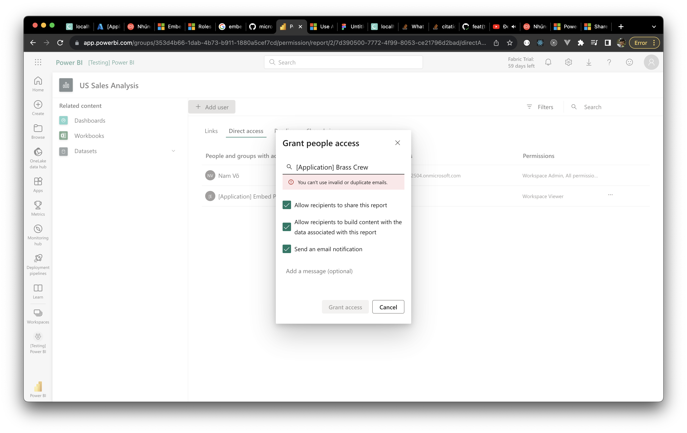

### Nhúng vào Website

1. Ta thu thập đủ các giá trị từ những bước trên, ta được:

   - `Tenant ID`
   - `Application (client) ID`
   - `Client secret`
   - `Workspace ID`
   - `Report ID`

2. Đối với ReactJS, ta sẽ dùng [powerbi-client-react](https://github.com/microsoft/powerbi-client-react) để nhúng vào.

```typescript
import { models } from "powerbi-client";
import { PowerBIEmbed } from "powerbi-client-react";

import styles from "./Report.module.css";

interface ReportProps {
  accessToken: string;
  embedUrl: string;
  reportID: string;
}

export default function Report(props: ReportProps) {
  const { accessToken, embedUrl, reportID } = props;

  return (
    <div className={styles.root}>
      <PowerBIEmbed
        embedConfig={{
          type: "report",
          id: reportID,
          embedUrl,
          accessToken,
          tokenType: models.TokenType.Embed,
          settings: {
            background: models.BackgroundType.Transparent,
            filterPaneEnabled: false,
            navContentPaneEnabled: false,
            panes: {
              filters: {
                expanded: false,
                visible: false,
              },
            },
            zoomLevel: 1,
          },
        }}
      />
    </div>
  );
}
```

Khoan, dừng khoảng chừng là 2 giây! `accessToken` và `embedUrl` ở đâu ra ấy nhờ? Ban đầu mình nói `embedUrl` không thể lấy trực tiếp từ <strong>File</strong> -> <strong>Embed report</strong>.

## Cách lấy "Access Token" và "Embed URL" từ Power BI

Ta đăng nhập vào Azure AD để có `accessToken` nhằm xác thực với Power BI.

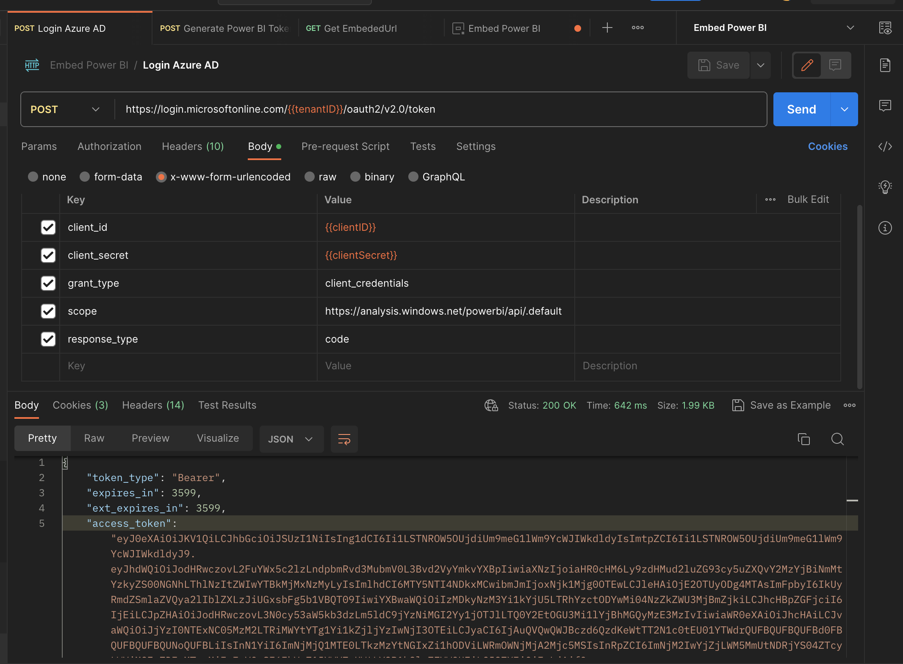

Những API tiếp theo, ta sẽ dùng `accessToken` từ Azure AD với type là `Bearer`. Giờ ta gọi API để lấy `accessToken` dùng cho `powerbi-client-react` phía trên.

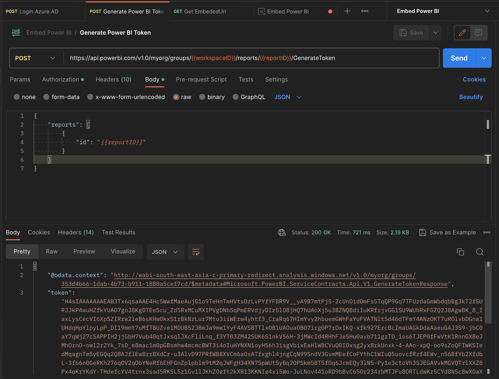

API này sẽ lấy `embedUrl`.

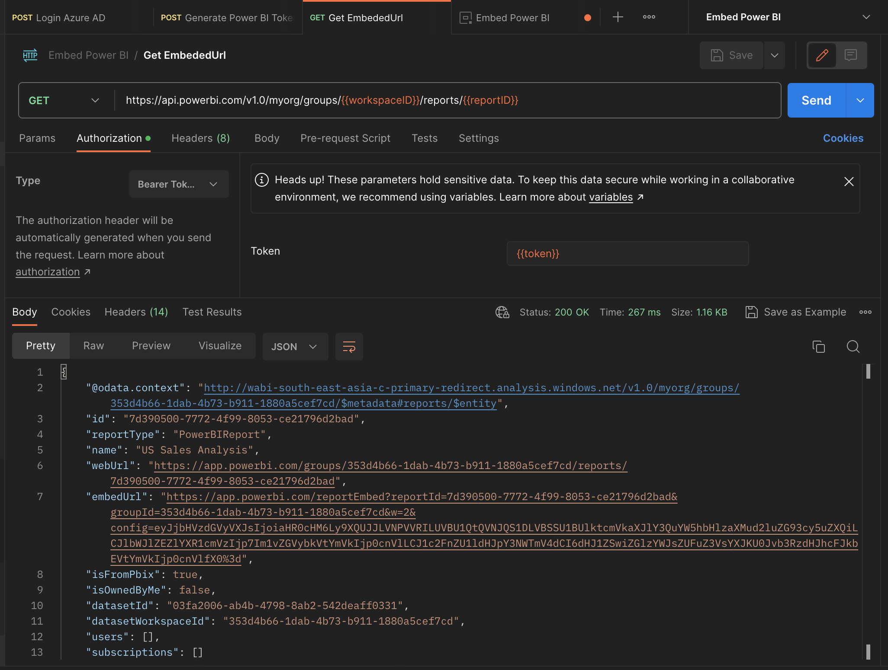

<strong className="text-red-500">Lưu ý:</strong> Ở đây mình không có publish Report,
nên khi bạn dán `embedUrl` vào Address Bar thì nó sẽ hiện màn hình này hoài luôn.

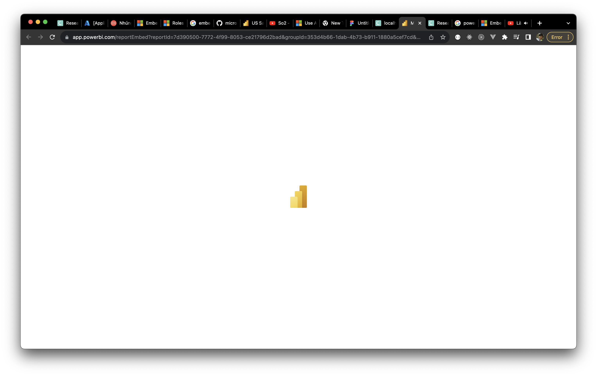

Khi load thành công thì nó sẽ như thế này.

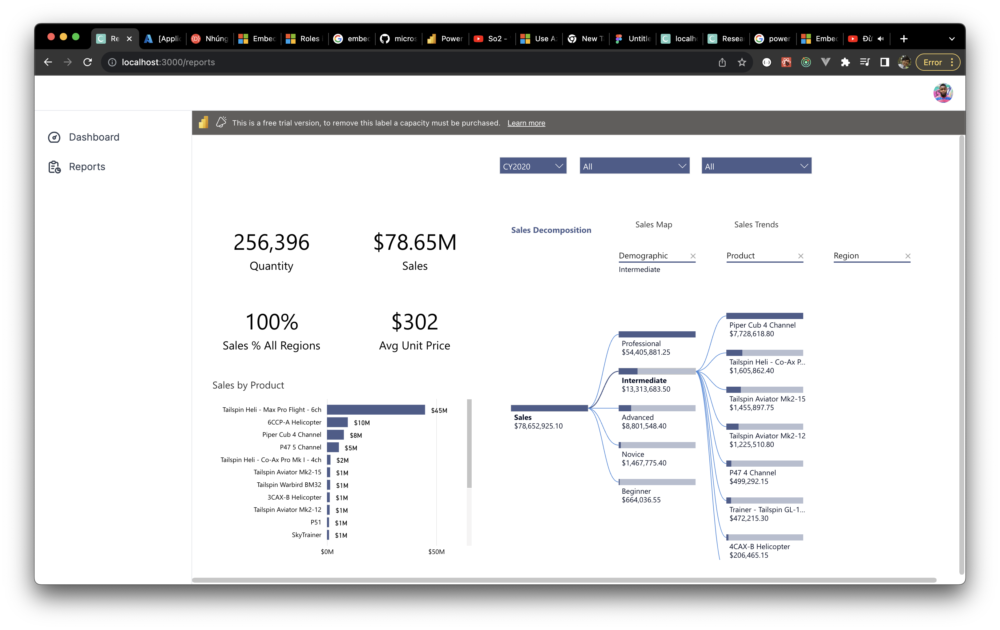

## Kết

Cảm ơn [Wongso](https://www.linkedin.com/in/wswijaya) và anh [Minh Lê](https://www.linkedin.com/in/minh-le-69468541) đã hỗ trợ bài viết này.

## Tham khảo

- Microsoft, [Embed Power BI content with service principal and an application secret](https://learn.microsoft.com/en-us/power-bi/developer/embedded/embed-service-principal)
- Microsoft, [Roles in workspaces in Power BI](https://learn.microsoft.com/en-us/power-bi/collaborate-share/service-roles-new-workspaces)
- GitHub, [powerbi-client-react](https://github.com/microsoft/powerbi-client-react)
- Microsoft, [Microsoft identity platform and the OAuth 2.0 client credentials flow](https://learn.microsoft.com/en-us/azure/active-directory/develop/v2-oauth2-client-creds-grant-flow)
