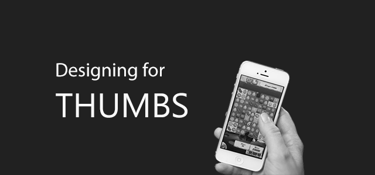
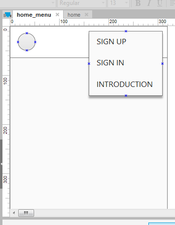
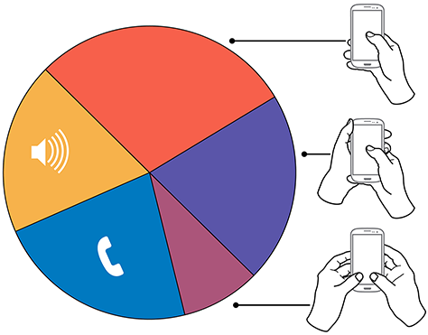
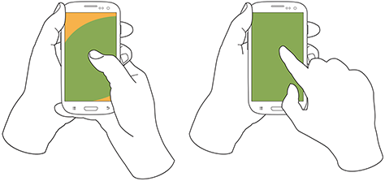

**"Quy tắc ngón tay cái"** mà mình đề cập trong bài viết này chính là thói quen sử dụng ngón tay cái trên mobile. Viết rõ ràng như vậy để tránh mấy bài viết dạng [quy tắc vàng, blah blah,...](https://en.wikipedia.org/wiki/Rule_of_thumb) Ý tưởng bài viết đến bất chợt khi mình gặp một số khó khăn.

## Ngón tay cái

Như đã nói, mình đang ngồi thiết kế [prototype](http://www.slideshare.net/pvanallen/prototyping-for-interaction-design) cho web khi hiển thị trên mobile ([Mobile First](http://zurb.com/word/mobile-first)). Đến lúc thiết kế menu điều hướng, mình xuất nó sang điện thoại để test bằng [Pixate](http://www.pixate.com/). Kết quả là mấy cái menu item như **SIGN UP**, **SIGN IN** và **INTRODUCTION** khó chạm được đúng vị trí bằng ngón tay cái. Và thế là mình quyết định tìm hiểu và dùng bài viết này để ghi chú lại kết quả tìm hiểu.

## Tại sao phải quan tâm tới ngón tay cái?

Trước hết, nhu cầu sử dụng mobile đang tăng. Do đó, kéo theo nhu cầu sử dụng phần mềm trên mobile, lướt web trên mobile,... Việc thiết kế giao diện cho mobile đang rất cần thiết.

Thống kê số lượng mobile sử dụng trên toàn thế giới năm 2012 - 2018 (Đơn vị: Tỉ) - Nguồn: statista.com

Hoặc các bạn có thể tham khảo link dưới đây:

- [Mobile Technology Fact Sheet](http://www.pewinternet.org/fact-sheets/mobile-technology-fact-sheet/)
- [U.S. Smartphone Use in 2015](http://www.pewinternet.org/2015/04/01/us-smartphone-use-in-2015/)

Trong thiết kế giao diện, ngoài yếu tố đẹp nữa thì còn phải dễ sử dụng, sử dụng thoải mái. Theo một số thống kê thói quen khi sử dụng smartphone trước đây, ta có thể chia cách sử dụng theo như hình dưới.

Tổng quan người dùng giữ và tương tác với điện thoại di động - Nguồn: uxmatters.com

Dựa vào cách giữ điện thoại và tương tác, ta sẽ chia ra làm 3 cách cơ bản (được đăng vào ngày 18 tháng 2, năm 2013):

- Sử dụng tay phải hoặc trái, dùng ngón tay cái để tương tác - **49%**.
  - Ngón cái tay phải - **67%**.
  - Ngón cái tay trái - **33%**.
- Một tay giữ, tay kia tương tác với màn hình - **36%**.
  - Tương tác bằng ngón tay: ngón tay cái (**72%**) - ngón tay trỏ (**28%**).
  - Giữ bằng bàn tay: bàn tay trái (**79%**) - bàn tay phải (**21%**).
- Giữ bằng 2 tay, sử dụng cả 2 ngón tay cái để tương tác - **15%**.
  - Để màn hình dọc - **90%**.
  - Để màn hình ngang - **10%**.

## Thumb Zone

Thumb Zone, bạn có thể hiểu nó là vùng mà ngón tay cái của bạn có thể thao tác được. Ta sử dụng 3 màu để làm rõ vấn đề:

- Xanh: Dễ dàng thao tác.
- Vàng: Phải với ngón tay ra chút xíu, nhưng vẫn chấp nhận được.
- Đỏ: Khó thao tác, từ bỏ đi.

Khi người dùng chỉ sử dụng một tay - Nguồn: uxmatters.com

Khi người dùng chỉ sử dụng một tay, tay còn lại để giữ điện thoại - Nguồn: uxmatters.com

Khi người dùng sử dụng cả 2 tay, dùng cả 2 ngón cái để tương tác - Nguồn: uxmatters.com

## Thiết kế

Về phần thiết kế, ta nên lưu ý một số vấn đề như sau:

- Bề rộng trung bình của ngón tay cái là 72 px.
- Bề rộng trung bình của ngón tay trỏ là 45 ~ 57px.
- Tính toán kích thước các components đủ rộng, nên thêm khoảng trống xung quanh.
- Để ý đến độ tuổi, thói quen, công việc (nếu cần) của đối tượng mà bạn muốn nhắm đến.
- Quan tâm đến kích thước các loại thiết bị. Nếu quá rộng, bạn hãy khoanh vùng chúng lại. Chẳng hạn, viết ứng dụng hỗ trợ tốt cho các màn hình kích thước 3.5 ~ 4.7 inch.
- Mỗi hệ điều hành đều có thông số riêng cho mình. Có thể tham khảo bản tóm tắt [Tự học User Interface cơ bản qua UI Document](incorporating) của Silicon Straits Saigon.
- Người sử dụng Mobile Web khác với Web thông thường, họ chỉ cần một số chức năng quan trọng. Hãy đảm bảo là họ có thể làm trực tiếp mọi vấn đề chỉ cần chạm ngón tay cái vào màn hình. Hạn chế đụng tới nút **Home**.
- Quên đi chuyện **"hover"** khi thiết kế dành cho các thiết bị cảm ứng nói chung.
- Nội dung đơn giản, rõ ràng.

## Thumb Flow

Hiểu nôm na là luồng xử lý của ngón tay cái. Dựa vào số liệu đã đưa phía trên, người dùng chủ yếu dùng bàn tay phải để giữ và ngón tay cái để thao tác. Do đó, bạn cần quan tâm đến các thao tác thường gặp nhất khi dùng ngón cái. Bạn có thể coi clip dưới đây để dễ hình dung.

Khi bạn nắm rõ cách người dùng sử dụng ngón cái thao tác thế nào, sẽ giúp chọn cách đặt components sao cho hợp lý. Dễ sử dụng, người dùng sẽ gắn bó lâu dài hơn. Vì bạn bỏ tiền ra mua sản phẩm để xài chứ không phải để "thờ".

## Chuyện bên lề

Những gì mình chia sẻ nãy giờ cũng giúp một phần nào giải quyết vấn đề của mình. Số liệu thống kê thì cũng hơi cũ mong các bạn thông cảm.

Trong việc thiết kế giao diện cho mobile, điều mình cảm thấy hơi khó chịu đó chính là kích thước màn hình. Nó đủ loại kích thước màn hình, có lần mình hơi khó khăn khi thiết kế, vì mình không chuyên về design nên chả biết ước lượng thế nào là dễ thao tác. Quan điểm của mình, màn hình cỡ iPhone 5S là vừa tay, nhét túi được nên nhiều khi thiết kế dựa theo nó. Sau đó, đưa wireframe sang iPhone 6, mấy con Sammsung màn hình lớn là banh xác và có đi chăng nữa, sử dụng cảm thấy vướng tay.

## Tham khảo

- [\[Infographic\] Nguyên tắc ngón tay cái trong thiết kế ứng dụng cho điện thoại](https://tinhte.vn/threads/infographic-nguyen-tac-ngon-tay-cai-trong-thiet-ke-ung-dung-cho-dien-thoai.2303841/)
- [Wireframing và Protyping cho ứng dụng Mobile](http://idesign.vn/content/an-tuong/kien-thuc/wireframing-va-protyping-cho-ung-dung-mobile/)
- [Slider Design: Rules of Thumb](http://www.nngroup.com/articles/gui-slider-controls/)
- [How Do Users Really Hold Mobile Devices?](http://www.uxmatters.com/mt/archives/2013/02/how-do-users-really-hold-mobile-devices.php)
- [Mobile Website Design: Follow the Rule of Thumb](http://www.thebrandonagency.com/blog/article/mobile-website-design-follow-the-rule-of-thumb/)
- [Mobile usability testing: Fat finger syndrome and touchscreen UIs](http://www.usability247.com/blog/mobile-usability-testing-fat-finger-syndrome/)
- [Number of mobile phone users worldwide from 2012 to 2018 (in billions)](http://www.statista.com/statistics/274774/forecast-of-mobile-phone-users-worldwide/)
- [Designing for touch](http://www.creativebloq.com/design/designing-touch-2123037)
- [Designing for Thumb Flow](http://www.lukew.com/ff/entry.asp?1734)
