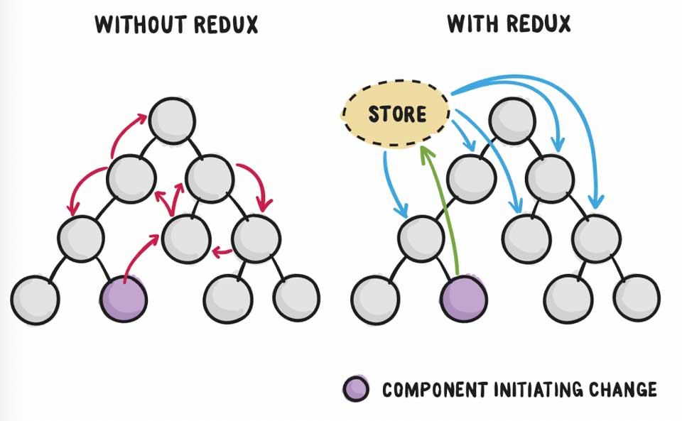
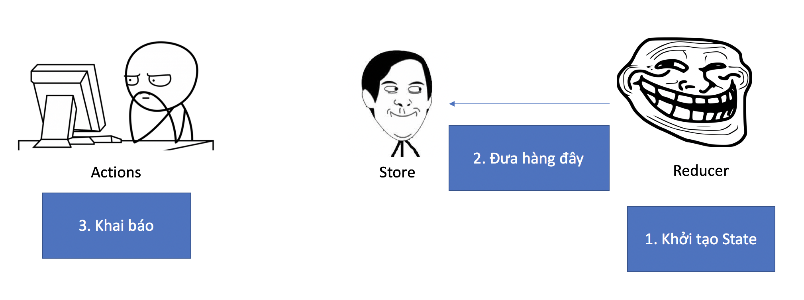
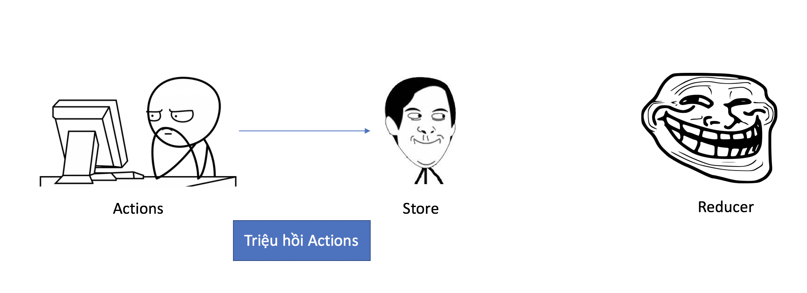

Để chuẩn bị cho công cuộc phỏng vấn vì miếng ăn, tớ phải tranh thủ tìm hiểu React và các công nghệ liên quan, trong đó có Redux. Đường cách mạng còn lắm gian truân, đọc document của nó éo hiểu gì hết. Hôm nay chia sẻ với mọi người cách tiếp cận Redux.

## Đặt vấn đề

Khi lập trình React, điều đầu tiên bực bội nhất là việc quản lý State. Như hình phía trên, để truyền dữ liệu giữa các component khá là lằng nhằng do chỉ truyền được cho component kề nhau. Do đó, cần có một cơ chế để quản lý state riêng biệt.

## Giải pháp

Ok, dễ nhất thì ta cứ xem state như biến toàn cục, khi cần thì viết Get/Set bình thường. Tớ có nghĩ đến `localStorage`. Tuy nhiên cách này khá bưởi, bạn có thể xem thêm tại đây.  
[Please Stop Using Local Storage](https://dev.to/rdegges/please-stop-using-local-storage-1i04)

Thử cách khác, ta hỏi chị Google. Kết quả là ta được 2 giải pháp đó là [Flux](https://facebook.github.io/flux/) và [Redux](https://redux.js.org/). Về phần Flux, ta có thể xem bài tutorial sau đây là hình dung được tư tưởng. Còn Redux, nó khá là hại não.  
Xem bài [Hướng dẫn và giải thích Flux bằng hình vẽ](https://kipalog.com/posts/Huong-dan-va-giai-thich-Flux-bang-hinh-ve)

## Redux

Giờ mới là phần chính. Ta thử vào xem trang chủ của Redux tại [https://redux.js.org](https://redux.js.org) xem có hiểu gì không nhé. Chắc cú là không dành cho beginner rồi. Tớ phải xem bài viết [React Redux Tutorial for Beginners: The Definitive Guide (2018)](https://www.valentinog.com/blog/react-redux-tutorial-beginners/) mới hình dung được Redux như thế nào.

Về cơ bản, Redux là một thư viện quản lý state, nó độc lập với React. Do đó, Redux có thể sử dụng chung với các thư viện khác vẫn được.

Các thành phần cơ bản của Redux bao gồm:

- **Store** - Nơi lưu trữ state
- **Actions** - Các hành động truyền dữ liệu được gởi từ ứng dụng đến Store
- **Reducer** - Xác định cách thay đổi State

## Ăn hành

Bây giờ tớ sẽ minh hoạ cho các bạn hiểu cách chạy bình thường của Redux nhé. Lúc này, ta chỉ đụng mỗi Redux thôi.

Đầu tiên, Reducer sẽ khởi tạo State và cách xác định thay đổi State. Sau đó, khởi tạo Store bằng Reducer đã khởi tạo trước đó. Lúc này, ta khai báo tiếp hành động.

Quá trình khởi tạo đã hoàn tất, ta khởi tạo tiếp một chút để bắt đầu test.

Bây giờ, bạn thử chạy đoạn code dưới đây ở Developer Tool.

Như bạn đã thấy, phía Store sẽ dispatch thằng ku Actions là State được thay đổi rồi. Như thế, ta có thể cho State tách biệt khỏi mớ Components.

## Ăn hành cùng với React

Ban đầu tớ nghĩ chúng ta có thể import Store vào nơi cần gọi là được. Nhưng giang hồ dùng chiêu thức khác, họ mapping State của Components với State của Store. Thặc vi diệu!!!

Để triển được chiêu thức đó, ta cần cài thêm package `react-redux`. Ghi nhớ khẩu quyết của chiêu thức này.

- **mapStateToProps** - dùng để map State của Component với State trong Store của Redux
- **mapDispatchToProps** - dùng để map method của Component với lời gọi action từ Store tới Actions của Redux

Sau đây là cách sử dụng.

## Chốt hạ

Hy vọng với cách trình bày của mình, các bạn hình dung được tư tưởng của Redux, cách dùng Redux với React như thế nào.

## Tham khảo

- Kipalog, [Hướng dẫn và giải thích Flux bằng hình vẽ](https://kipalog.com/posts/Huong-dan-va-giai-thich-Flux-bang-hinh-ve)
- Valentinog, [React Redux Tutorial for Beginners: The Definitive Guide (2018)](https://www.valentinog.com/blog/react-redux-tutorial-beginners/)
