## Ánh sáng khả kiến

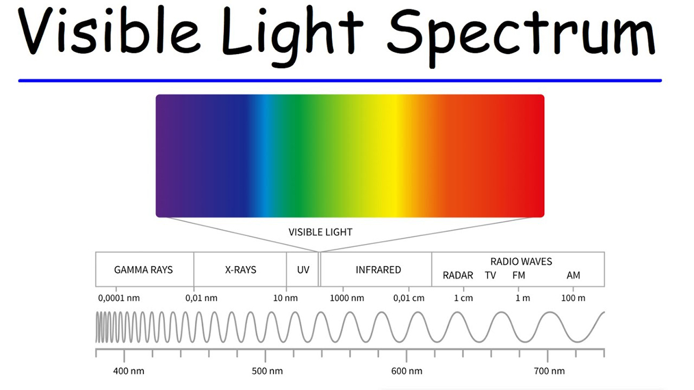

Ánh sáng khả kiến là ánh sáng mà mắt người có thể nhìn thấy. Bước sóng lambda `(λ)` biểu thị cho màu sắc của ánh sáng, đơn vị là nanomet `(nm)`.

Các tài liệu phổ thông thường đơn giản hóa dải nhìn thấy của mắt người thành một khoảng cố định (ví dụ `400 nm - 700 nm` hoặc `380 nm - 760 nm`) để dễ nhớ. Trên thực tế, ranh giới này không hoàn toàn cố định vì độ nhạy của mắt người suy giảm dần ở hai đầu phổ thay vì dừng đột ngột tại một bước sóng cụ thể.

- [NASA](https://science.nasa.gov/ems/09_visiblelight/): 380 nm - 700 nm
- [CIE](https://www.cie.co.at/publications/colorimetry-part-3-cie-tristimulus-values-2): 380 nm - 780 nm

### S - M - L

Đây không phải nói về kích thước (Small - Medium - Large) mà là các tế bào hình nón.

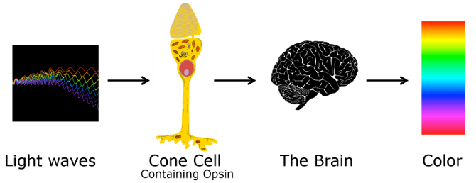

Thoạt nhìn, có vẻ như mắt người hoạt động giống một máy quang phổ thu nhỏ. Khi ánh sáng có bước sóng 450 nm đi vào mắt, não sẽ biết đó là màu xanh lam. Khi ánh sáng có bước sóng 650 nm đi vào mắt, não sẽ biết đó là màu đỏ.

Tuy nhiên, thực tế lại không diễn ra như vậy.

Mắt người không đo trực tiếp bước sóng của ánh sáng. Thay vào đó, võng mạc chỉ chứa một số loại cảm biến sinh học có khả năng phản ứng với ánh sáng ở những mức độ khác nhau. Đối với việc cảm nhận màu sắc, ba loại cảm biến quan trọng nhất là các tế bào nón (cone cells).

Trong điều kiện đủ sáng, phần lớn khả năng nhận biết màu sắc của con người đến từ ba loại tế bào nón:

| Loại tế bào | Độ nhạy cao nhất          |
| ----------- | ------------------------- |
| S-cone      | Vùng bước sóng ngắn       |
| M-cone      | Vùng bước sóng trung bình |
| L-cone      | Vùng bước sóng dài        |

Nhiều tài liệu phổ thông thường gọi chúng là: **Blue cone**, **Green cone**, **Red cone**.

Tuy nhiên cách gọi này có thể gây hiểu nhầm. **L-cone** không chỉ phản ứng với ánh sáng đỏ. Tương tự, **M-cone** cũng không chỉ phản ứng với ánh sáng xanh lá. Mỗi loại cone thực chất phản ứng với một dải bước sóng khá rộng và các vùng phản ứng này chồng lấn lên nhau đáng kể.

### Tế bào que và tế bào nón

Mặc dù bài viết này tập trung vào màu sắc, các tế bào nón không phải là loại cảm biến duy nhất trên võng mạc.

Võng mạc của con người còn chứa một loại tế bào cảm quang khác gọi là **tế bào que** (_rod cells_). Nếu tế bào nón chịu trách nhiệm chính cho việc cảm nhận màu sắc trong điều kiện đủ sáng, thì tế bào que lại đóng vai trò quan trọng trong môi trường thiếu sáng.

Tế bào que nhạy với ánh sáng hơn tế bào nón rất nhiều, cho phép chúng ta vẫn có thể nhìn thấy vật thể vào lúc chạng vạng hoặc ban đêm. Tuy nhiên, khả năng này phải đánh đổi bằng việc gần như không phân biệt được màu sắc. Đó là lý do khi trời tối, thế giới xung quanh thường dần chuyển sang những tông xám thay vì giữ được màu sắc phong phú như ban ngày.

Nói một cách đơn giản, hệ thị giác của con người hoạt động dựa trên hai nhóm cảm biến khác nhau:

| Loại cảm biến     | Chức năng chính                                   |
| ----------------- | ------------------------------------------------- |
| Tế bào que (Rod)  | Độ sáng, hoạt động tốt trong điều kiện thiếu sáng |
| Tế bào nón (Cone) | Màu sắc, hoạt động tốt trong điều kiện đủ sáng    |

_Có thể bạn chưa biết, con người có khoảng `120 triệu tế bào que` nhưng chỉ khoảng `6 triệu tế bào nón`. Nghe hơi ngược đời vì chúng ta thường nghĩ màu sắc là thứ quan trọng nhất, nhưng xét về số lượng thì võng mạc lại ưu tiên khả năng phát hiện ánh sáng hơn khả năng nhận biết màu sắc._

### Không có cảm biến nào "nhìn thấy màu"

Giả sử một L-cone đang nhận tín hiệu từ môi trường. Từ góc nhìn của chính tế bào đó, nó không biết ánh sáng đến từ bước sóng nào, cũng không biết đó là màu đỏ, màu cam hay màu vàng. Điều duy nhất nó biết là có bao nhiêu `photon` đang kích thích nó tại thời điểm đó.

Vì vậy, cùng một mức tín hiệu có thể được tạo ra bởi nhiều tình huống hoàn toàn khác nhau. Một ánh sáng đỏ có cường độ thấp, một ánh sáng cam có cường độ trung bình hoặc một ánh sáng vàng có cường độ cao đều có thể khiến L-cone phản ứng gần như giống nhau. Đối với bản thân tế bào này, những trường hợp đó không thể phân biệt được.

Nói cách khác, một tế bào nón chỉ biết **mức độ kích thích**, chứ không biết **nguyên nhân gây ra kích thích**. Điều này dẫn đến một câu hỏi thú vị: nếu từng tế bào riêng lẻ đều không biết màu sắc là gì, tại sao chúng ta vẫn có thể nhìn thấy một thế giới đầy màu sắc?

## Từ cảm nhận màu sắc tới biểu đồ CIE 1931

### Màu sắc xuất hiện từ sự so sánh

Câu trả lời nằm ở việc não bộ không đọc tín hiệu từ một tế bào nón duy nhất. Mỗi loại tế bào nón có một đường cong độ nhạy riêng đối với ánh sáng. Khi một nguồn sáng đi vào mắt, từng bước sóng trong phổ ánh sáng sẽ kích thích các tế bào S, M và L ở những mức độ khác nhau.

Màu sắc chỉ xuất hiện khi não bộ đặt ba tín hiệu này cạnh nhau và so sánh chúng với nhau. Chính mối quan hệ giữa phản ứng của S, M và L mới tạo nên cảm nhận màu sắc mà chúng ta trải nghiệm hàng ngày.

Ý tưởng này thực ra không phải là phát hiện mới của thế kỷ XX. Ngay từ đầu những năm 1800, nhà vật lý [Thomas Young](https://thomasyoungcentre.org/about-tyc/who-was-thomas-young/) đã đề xuất rằng mắt người có thể chỉ cần ba loại cảm biến để cảm nhận màu sắc. Vài thập kỷ sau, Hermann von Helmholtz tiếp tục phát triển ý tưởng này thành **Lý thuyết Tam sắc** [(_Trichromatic Theory_)](https://pmc.ncbi.nlm.nih.gov/articles/PMC3095437/).

Nếu lý thuyết này là đúng, một câu hỏi tự nhiên xuất hiện:

> Nếu mắt người cảm nhận màu sắc thông qua ba tín hiệu độc lập, liệu mọi màu sắc có thể được biểu diễn bằng chỉ ba giá trị hay không?

Để trả lời câu hỏi đó, các nhà khoa học không cố gắng đo trực tiếp hoạt động của các tế bào nón. Với công nghệ thời bấy giờ, điều đó gần như là bất khả thi. Thay vào đó, họ chọn một cách tiếp cận đơn giản hơn: sử dụng chính mắt người làm công cụ đo lường.

### Thí nghiệm phối màu

Trong những năm 1920, các nhà nghiên cứu như [William David Wright](https://en.wikipedia.org/wiki/William_David_Wright) và [John Guild](https://en.wikipedia.org/wiki/John_Guild) thực hiện hàng loạt thí nghiệm phối màu (_color matching experiments_).

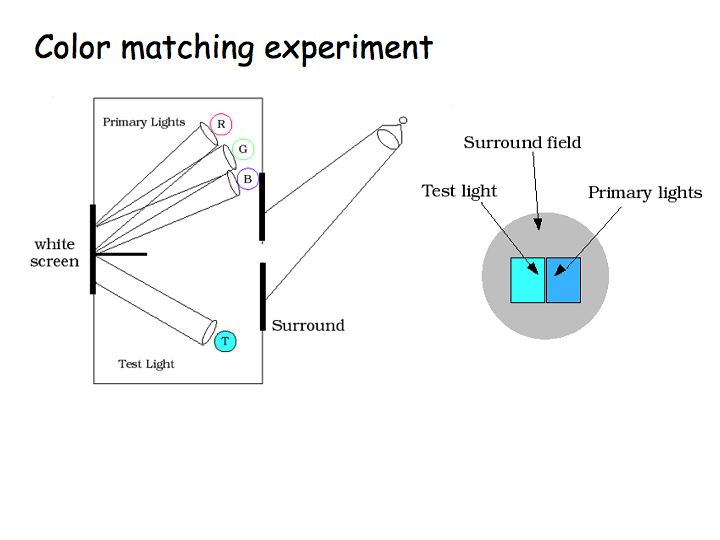

Để định lượng lý thuyết này, họ cho những người tham gia thí nghiệm nhìn vào một màn hình chia đôi:

- Một nửa màn hình chiếu một bước sóng màu thuần khiết bất kỳ (ví dụ: màu vàng phổ có bước sóng 580 nm).
- Nửa màn hình còn lại chiếu sự pha trộn của 3 nguồn sáng chuẩn: Đỏ (700 nm), Xanh lá (546.1 nm), và Xanh dương (435.8 nm).
- Người tham gia sẽ vặn các nút điều chỉnh cường độ của 3 nguồn sáng RGB này sao cho nửa màn hình bên phải trùng khớp hoàn toàn về mặt thị giác với màu ở nửa màn hình bên trái.

Từ kết quả của hàng ngàn lần thử nghiệm, họ vẽ ra được đồ thị Hàm khớp màu (Color Matching Functions), cho biết chính xác cần bao nhiêu lượng Red, Green, và Blue để tạo ra một bước sóng ánh sáng cụ thể. Đây chính là dữ liệu thô để tính toán ra tọa độ không gian màu.

## Biểu đồ màu sắc CIE 1931

Dựa trên các kết quả đã nói phía trên, Ủy ban Chiếu sáng Quốc tế ([_Commission Internationale de l'Éclairage_ - CIE](https://cie.co.at/)) đã công bố hệ màu chuẩn đầu tiên vào năm 1931.

Mục tiêu của họ không phải là mô tả bản chất vật lý của ánh sáng, mà là xây dựng một mô hình toán học phản ánh cách con người cảm nhận màu sắc. Nói cách khác, biểu đồ CIE 1931 không phải là bản đồ của bước sóng ánh sáng, mà là bản đồ của nhận thức màu sắc.

Đây là một khác biệt rất quan trọng.

Hai nguồn sáng có thể sở hữu phổ năng lượng hoàn toàn khác nhau nhưng vẫn tạo ra cùng cảm nhận màu sắc nếu chúng kích thích các tế bào S, M và L theo cùng một tỷ lệ. Chính vì vậy, hệ màu CIE được xây dựng dựa trên phản ứng của người quan sát thay vì dựa trực tiếp trên phổ ánh sáng.

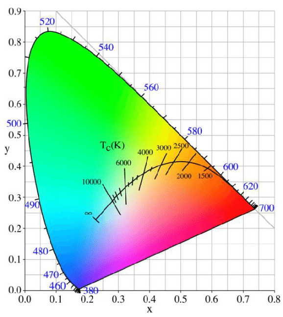

### Một số điều cần lưu ý

#### Bản chất sinh học: Mắt người không "bật/tắt" đột ngột tại `380 nm` và `760 nm`

Như đã nói ở đầu bài viết, trong các sách giáo khoa vật lý hoặc sinh học phổ thông, người ta gom dải nhìn thấy về `380 - 760 nm` (hoặc `400 - 700 nm`) để dễ nhớ.

Tuy nhiên, hàm nhạy cảm của các tế bào nón trong mắt người không giảm về bằng `0` ngay lập tức tại `380 nm` hay vọt lên đột ngột. Nó là một đường cong chuông giảm dần về hai đầu.

- **Ở vùng cận tử ngoại (UV):** Tại `380 nm`, mắt người vẫn cảm nhận được ánh sáng nhưng cực kỳ yếu. Nếu nguồn sáng phát ra năng lượng đủ lớn (cường độ cực mạnh), mắt người khỏe mạnh hoàn toàn có thể lờ mờ nhìn thấy các bước sóng sâu hơn xuống mức `370 nm`, `360 nm`.
- **Ở vùng cận hồng ngoại (IR):** Tương tự, tại `760 nm` dải màu đỏ đã rất tối. Nhưng nếu có một tia Laser công suất cao chiếu ở mức `800 nm` hoặc `830 nm`, võng mạc của chúng ta vẫn ghi nhận được một kích thích màu đỏ sẫm cực mờ (faint red).

#### Mục tiêu toán học của CIE: Triệt tiêu hoàn toàn "Sai số tích phân"

Khi xây dựng hệ thống CIE 1931, mục tiêu của các nhà khoa học là tạo ra một thước đo năng lượng màu sắc chuẩn xác phục vụ cho công nghiệp sản xuất bóng đèn, kính quang học và in ấn.

Như chúng ta đã làm ở các câu trước, để tính ra giá trị `X`, `Y`, `Z` của một nguồn sáng, máy tính phải thực hiện phép tích phân (cộng tổng năng lượng toàn bộ dải phổ):

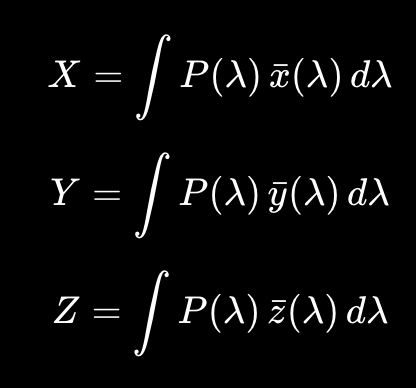

Trong đó:

- `P(λ)`: Spectral Power Distribution (SPD) của nguồn sáng.
- `x̄(λ)`, `ȳ(λ)`, `z̄(λ)`: CIE Color Matching Functions.
- `X`, `Y`, `Z`: CIE Tristimulus Values.

Nếu dữ liệu CMF bị cắt chặt chỉ trong khoảng sách giáo khoa như `380 nm` và `780 nm` (thay vì dải đầy đủ `360 - 830 nm`):

- Phần năng lượng mờ nhạt nhưng có thật ở dải `360 - 380 nm` và `760 - 830 nm` sẽ bị coi là bằng `0`.
- Khi đo các nguồn sáng công nghiệp có năng lượng đỉnh (peak energy) rơi đúng vào vùng biên này, kết quả tính toán toán học sẽ bị sai số tích phân (_Truncation Error_), khiến màu sắc tính ra trên máy tính bị lệch một chút so với mắt người nhìn thực tế.

Do đó, CIE đã quyết định nới rộng dải dữ liệu từ `360 nm` đến `830 nm` để đảm bảo hàm số quét sạch phần đuôi của đường cong sinh học, đưa sai số tích phân về mức không đáng kể.

**Tóm lại:** Việc CIE mở rộng dải từ `360 - 830 nm` không làm hình móng ngựa to ra hay dài ra thêm về mặt hình học phẳng, vì các điểm ngoài biên đều tự động chồng lên nhau tại hai đầu mút. Nhưng về mặt `dữ liệu số (Digital Data)`, nó là một "vùng đệm an toàn" bắt buộc phải có để các thuật toán ma trận và tích phân của phần mềm đồ họa chạy chính xác, không làm mất bất kỳ một chút chi tiết năng lượng nào của ánh sáng.

### Quỹ tích quang phổ (Spectral Locus)

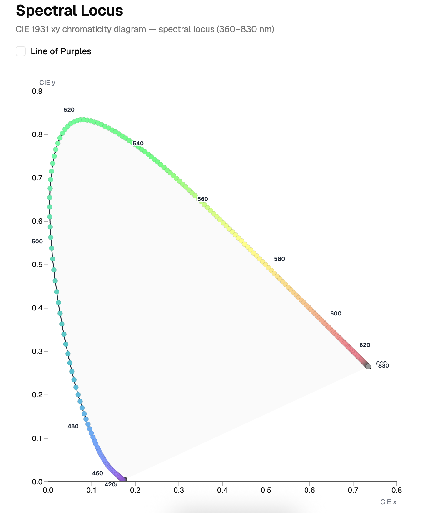

Đường viền cong phía trên của hình móng ngựa được gọi là `quỹ tích quang phổ` (Spectral Locus), đại diện cho các **màu phổ thuần khiết nhất** (Spectral Colors) — tức là ánh sáng chỉ có duy nhất một bước sóng (như ánh sáng tia Laser hoặc ánh sáng sau khi đi qua lăng kính).

- Khi các nhà khoa học lấy dữ liệu từ thí nghiệm trộn màu (lượng R, G, B cần thiết cho mỗi bước sóng) rồi dùng toán học chuyển đổi sang hệ tọa độ phẳng _(x, y)_, các điểm tọa độ này tự động nối lại với nhau thành một **đường cong mở**; phần đáy tím (Line of Purples) nối hai đầu lại mới tạo thành hình móng ngựa.
- Tại sao nó cong mà không thẳng? Vì phản ứng của các tế bào nón trong mắt người với các bước sóng ánh sáng không tăng giảm theo đường thẳng (tuyến tính), mà chúng chồng lấn lên nhau theo các đường cong sinh học.

Để vẽ được biểu đồ này, ta sẽ cần tải về bảng dữ liệu [CIE 1931 colour-matching functions, 2 degree observer](https://cie.co.at/datatable/cie-1931-colour-matching-functions-2-degree-observer) dưới dạng file CSV.

Bước đầu tiên là đọc các giá trị `x̄(λ)`, `ȳ(λ)` và `z̄(λ)` tương ứng với từng bước sóng λ trong khoảng từ `360 nm` đến `830 nm`. Để xây dựng đường biên của biểu đồ CIE 1931, mỗi bước sóng được xem như một nguồn sáng đơn sắc có năng lượng bằng 1 tại chính bước sóng đó và bằng 0 ở mọi bước sóng còn lại. Trong trường hợp này, các giá trị `X`, `Y` và `Z` của nguồn sáng đơn sắc chính là các giá trị `x̄(λ)`, `ȳ(λ)` và `z̄(λ)` được tra trực tiếp từ bảng dữ liệu.

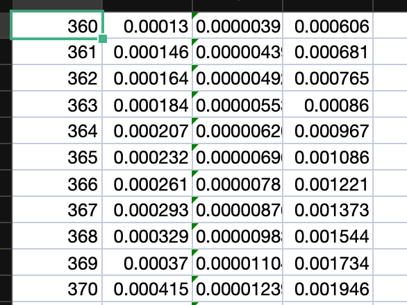

Sau đó, ta áp dụng công thức này theo bước sóng để tính toán giá trị `x` và `y` để thể hiện trên biểu đồ.

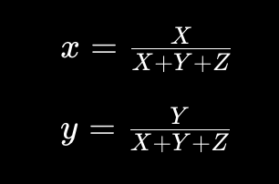

Ta sẽ làm ví dụ với bước sóng `550 nm`.

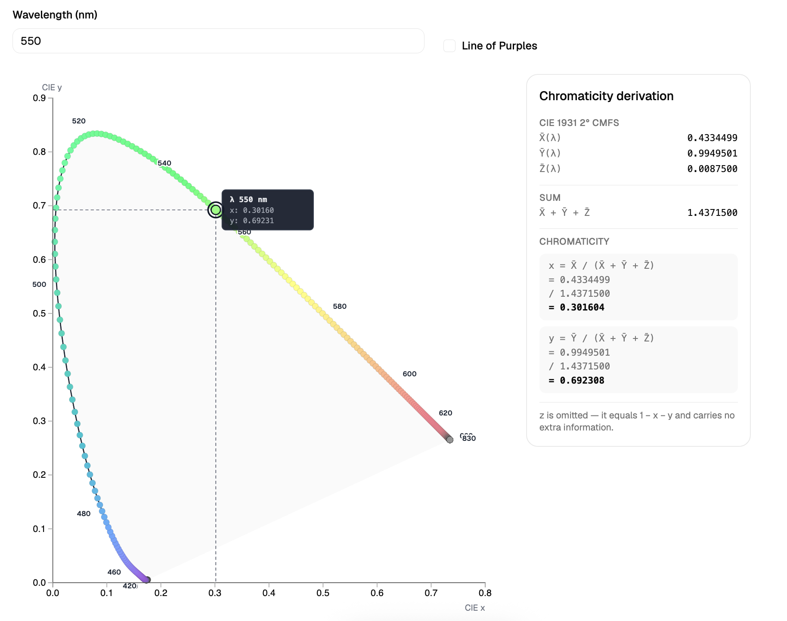

### Đường thẳng đáy/tím (Line of Purples)

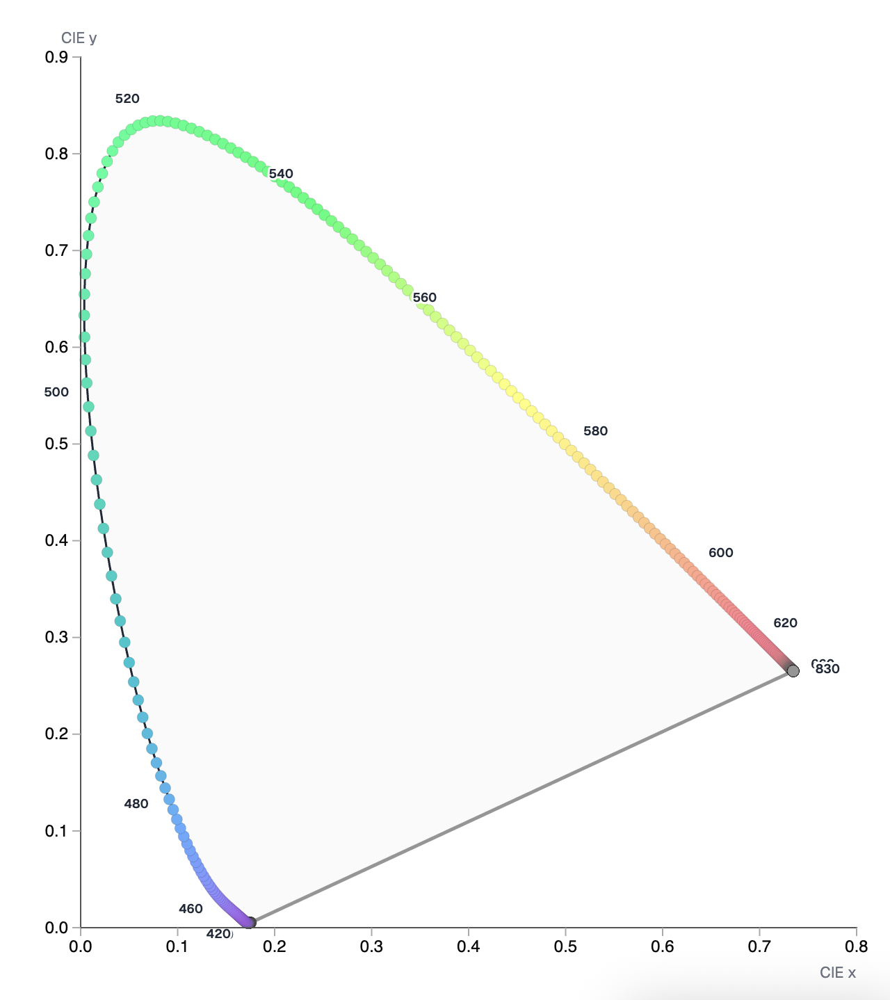

Đáy của hình móng ngựa là một đường thẳng căng ngang nối từ điểm màu Tím (bước sóng ngắn nhất) sang điểm màu Đỏ (bước sóng dài nhất).

- Đường này gọi là **Đường màu tím (Line of Purples)**.
- Trong tự nhiên, **không có bất kỳ bước sóng đơn sắc nào tạo ra được các màu magenta/tím mận này**. Mắt người chỉ nhìn thấy các màu này khi võng mạc nhận được cùng một lúc cả ánh sáng bước sóng dài (Đỏ) và ánh sáng bước sóng ngắn (Xanh dương) trộn lẫn với nhau.
- Vì nó là sự pha trộn tuyến tính giữa hai điểm cực đoan của dải quang phổ, nên khi vẽ lên đồ thị, nó tạo thành một **đường thẳng tắp** nối liền hai đầu của đường cong quang phổ.

Có một sự thú vị khi tìm định nghĩa về `Violet` và `Purple` trên [Reddit](https://www.reddit.com/r/colors/comments/1f8z3ew/violet_vs_purple/):

- `Violet` là màu đơn sắc có bước sóng riêng trên quang phổ.
- `Purple` thường được tạo ra bởi sự pha trộn giữa màu đỏ và xanh dương.

### Vùng không gian bên trong: Sự pha trộn màu nhạt dần

Toàn bộ phần diện tích nằm bên trong hình móng ngựa là kết quả của việc pha trộn các bước sóng thuần khiết đó với nhau hoặc trộn với ánh sáng trắng. Khi bạn đi từ viền ngoài (màu bão hòa 100%) tiến dần về phía **White Point**, màu sắc sẽ bị mất dần độ bão hòa (nhạt đi) cho đến khi hội tụ tại vùng trung tính bên trong biểu đồ — lưu ý White Point không nằm ở tâm hình học của móng ngựa.

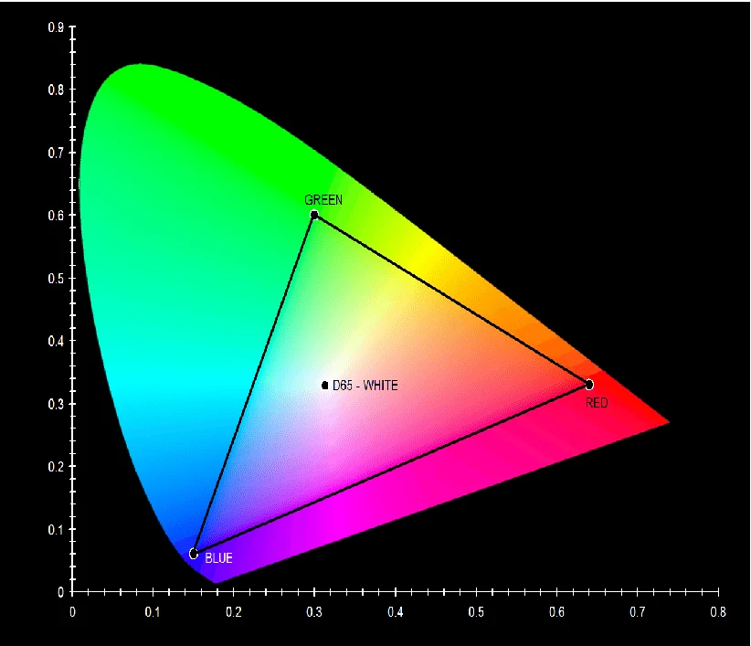

## Hình học của sự thích ứng màu sắc

Trong phần trước, chúng ta đã tìm hiểu cách ánh sáng được biểu diễn trên biểu đồ CIE 1931. Tuy nhiên, để nói về **cân bằng trắng (_White Balance_)**, một câu hỏi quan trọng vẫn còn bỏ ngỏ: `đâu là màu trắng?`

Thoạt nhìn, màu trắng có vẻ là một khái niệm tuyệt đối. Thế nhưng trong thực tế, ánh sáng ban ngày, đèn tungsten hay ánh sáng dưới bóng râm đều có màu sắc khác nhau, và mắt người liên tục thích nghi với những thay đổi đó. Chính khả năng thích ứng này là nền tảng của các khái niệm như _White Point_, _Color Temperature_, _Tint_ và _White Balance_ mà chúng ta sẽ khám phá sau đây.

### Điểm trắng (White Point)

Trong Color Science, White Point không đơn thuần là màu trắng của một tờ giấy trắng. Nó là một tập hợp tọa độ `(x, y)` đại diện cho _nguồn sáng tham chiếu (Reference Illuminant)_ của toàn bộ hệ thống.

Do mắt người có một siêu năng lực sinh học gọi là sự ổn định màu sắc (color constancy) — não bộ luôn tự động điều chỉnh để một tờ giấy trắng nhìn vẫn trắng dù là dưới ánh nến hay trời nắng. Nhưng máy tính và camera thì "vô tri", chúng cần một con số tuyệt đối làm mỏ neo. Nếu không định nghĩa White Point, hệ thống sẽ không có gốc tọa độ để tính toán xem các màu sắc khác (đỏ, xanh, vàng) phải lệch đi bao nhiêu độ. White Point chính là chiếc la bàn định hình toàn bộ ranh giới của một không gian màu.

Vậy làm sao để xác định được tọa độ của White Point trong tự nhiên khi mà ánh sáng môi trường liên tục thay đổi? Câu trả lời nằm ở một quy luật vật lý tối thượng của vũ trụ: `Bức xạ vật đen (Blackbody Radiation)` và khái niệm `Nhiệt độ màu (Color Temperature)`.

#### "Vật đen tuyệt đối" (Blackbody)

Trong vật lý, Vật đen tuyệt đối là một vật thể giả định (không có thực 100% ngoài tự nhiên) sở hữu một đặc tính hoàn hảo: Nó hấp thụ toàn bộ 100% mọi bức xạ điện từ (ánh sáng, tia UV, tia hồng ngoại...) chiếu vào nó mà không hề phản xạ hay cho xuyên qua bất kỳ một chút nào. Vì nó hấp thụ hết nên nhìn bằng mắt thường khi ở nhiệt độ phòng, nó sẽ có màu đen kịt tuyệt đối.

Tuy nhiên, bước ngoặt xảy ra khi ta bắt đầu nung nóng nó lên.

Theo định luật bảo toàn năng lượng, khi nuốt một lượng nhiệt lớn, nó không thể giữ mãi mà bắt buộc phải giải phóng năng lượng ra ngoài môi trường bằng cách tự phát xạ ra các sóng điện từ. Hiện tượng này chính là **Bức xạ vật đen (Blackbody Radiation)**.

#### Mối liên hệ giữa "Vật đen" và "Nhiệt độ màu" (Color Temperature)

Điều kỳ diệu của vũ trụ là: Phổ của ánh sáng phát ra từ vật đen này chỉ phụ thuộc duy nhất vào Nhiệt độ nung của nó (tính bằng Kelvin), chứ không phụ thuộc vào chất liệu cấu tạo nên nó là sắt, đồng hay đất sét.

Khi ta tăng dần nhiệt độ, động năng của các nguyên tử bên trong vật đen dao động điên cuồng hơn, khiến nó phát ra các bước sóng có năng lượng ngày càng cao (bước sóng ngắn dần):

- Nung đến `1000 K - 2000 K`: Nó phát ra bước sóng dài, chủ yếu là hồng ngoại và một ít ánh sáng đỏ. Mắt người nhìn thấy nó rực lên màu đỏ cam trầm (giống hoàng hôn, ánh nến).
- Nung đến `3000 K - 4000 K`: Các bước sóng ngắn hơn bắt đầu xuất hiện nhiều hơn. Màu sắc chuyển dần sang vàng ấm (giống đèn dây tóc).
- Nung đến `5500 K - 6500 K`: Lúc này, phổ vật đen cân bằng hơn giữa các vùng bước sóng; khi tích phân qua hàm khớp màu của mắt người, cảm nhận sẽ là màu trắng tinh khiết (giống ánh sáng mặt trời nắng trưa).
- Nung đến `10000 K - 20000 K`: Đỉnh năng lượng lệch hẳn về phía bước sóng siêu ngắn. Vật đen lúc này tỏa ra sắc xanh lam lạnh lẽo.

Đây chính là lý do tại sao giới làm phim/nhiếp ảnh gọi màu xanh dương là màu "Lạnh" (Cool) còn màu đỏ/vàng là màu "Ấm" (Warm). Nhưng về mặt vật lý tự nhiên, màu Xanh dương mới là màu có nhiệt độ siêu nóng, còn màu Đỏ/Vàng thực chất là nhiệt độ... đang nguội bớt! Đúng hơn thì tùy thuộc vào phần mềm bạn sử dụng, sẽ có lúc giá trị của Color Temperature nó không giống nhau (lúc giá trị nhỏ là xanh, lúc giá trị nhỏ là đỏ).

#### Tại sao lại xuất hiện D65/D60/D55?

Đến đây, các nhà khoa học CIE gặp một vấn đề lớn: Ánh sáng mặt trời thực tế ngoài đời không phải là ánh sáng của một vật đen hoàn hảo.

Ánh sáng mặt trời khi đi xuyên qua tầng khí quyển của Trái Đất sẽ bị bầu khí quyển hấp thụ, tán xạ (Tán xạ Rayleigh), bị mây che,... làm cho phổ ánh sáng thực tế bị méo mó, trồi sụt chứ không mượt mà như đường cong lý thuyết của vật đen.

Để giải quyết việc này, CIE đã đo đạc ánh sáng mặt trời thực tế ở nhiều mốc thời gian và thời tiết khác nhau, rồi dùng toán học để thiết lập nên [Series D (Daylight Illuminants)](https://en.wikipedia.org/wiki/Standard_illuminant#Illuminant_series_D).

- D55, D60, D65 thực chất là cụm từ viết tắt của Daylight `5500 K`, Daylight `6000 K`, và Daylight `6500 K`.
- Chữ số đi sau chữ D đại diện cho [Correlated Color Temperature (CCT - Nhiệt độ màu tương quan)](https://en.wikipedia.org/wiki/Correlated_color_temperature).

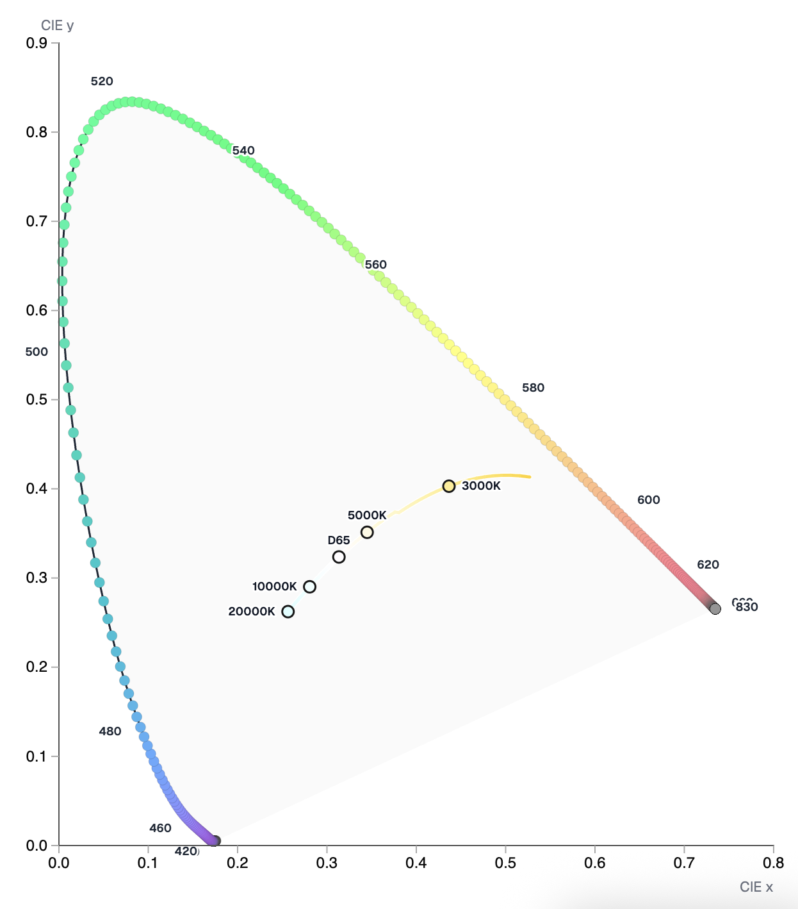

Vì ánh sáng trời (Daylight) thực tế bị méo phổ nên nó không nằm trùng khít 100% trên **đường ray vật đen (Planckian Locus)**. Do đó, các nhà khoa học đã tìm mốc nhiệt độ của vật đen nào gần giống nhất với ánh sáng trời lúc đó để dán nhãn:

- Ánh sáng nắng trưa trực tiếp có phổ gần giống với một vật đen bị nung ở mức `5500 K` nhất → Đặt tên là `D55`.
- Ánh sáng tiêu chuẩn của viện hàn lâm điện ảnh có phổ tương quan với vật đen ở mức `6000 K` → Đặt tên là `D60`.
- Ánh sáng ngày trung bình (hơi có tí mây và bầu trời xanh áp vào) có phổ tương quan với vật đen ở mức `6500 K` → Đặt tên là `D65`.

#### Giải thích theo góc nhìn Color Grading

##### D55 (5500K) — Kỷ nguyên của Hóa chất và Cuộn phim Analog

- **Góc độ Vật lý:** `5500 K` là nhiệt độ của vật đen phát ra dải phổ mô phỏng **Ánh nắng mặt trời trực tiếp (Direct Sunlight)** vào giữa trưa.
- **Tại sao lại dùng cho Film Analog & In ấn?**
  - **Thời xưa (Film):** Khi các hãng như Kodak hay Fujifilm sản xuất ra các cuộn phim âm bản (Negative Film), họ phải chọn một môi trường ánh sáng tiêu chuẩn để tráng phủ hóa chất lên bề mặt phim. Họ chọn ánh sáng nắng trưa tự nhiên làm chuẩn — gọi là film hệ **Daylight (được cân bằng ở `5500 K`)**. Nếu mang cuộn phim này đi chụp dưới nắng, màu sắc sẽ lên chuẩn chỉnh và trung thực nhất.
  - **Ngành in (Print):** Khi ta in một bức ảnh ra giấy, tờ giấy đó không tự phát sáng như màn hình. Để nhìn thấy màu của nó, bạn phải rọi một nguồn sáng bên ngoài vào. Trong ngành in ấn tiêu chuẩn, người ta dùng các bóng đèn giả lập ánh sáng nắng trưa chuẩn **D55** (hoặc D50 tùy thị trường) để soi bài in, đảm bảo màu sắc của mực trên giấy phản xạ đúng nhất với môi trường tự nhiên ngoài trời.

##### D60 (6000K) — Tiêu chuẩn Vàng của Máy chiếu Rạp và Điện ảnh ACES

- **Góc độ Vật lý:** `6000 K` là mốc nhiệt độ giúp vật đen dịu bớt sắc xanh gắt của bầu trời, ngả nhẹ về một tông trắng có chút hơi ấm (warmth) nhẹ nhàng.
- **Tại sao lại dùng cho Phim chiếu rạp?**
  - **Môi trường rạp phim (Dark Surround):** Khi ta vào rạp phim, xung quanh là một phòng tối thui, mắt người sẽ bị kích thích thị giác theo kiểu khác so với khi ngồi ở phòng khách sáng đèn. Màn hình chiếu rạp (Projector) có cường độ sáng thấp hơn nhiều so với tivi cường độ cao.
  - Nếu dùng chuẩn D65 (`6500 K`) quá xanh và sáng cho máy chiếu rạp, mắt người nhìn lâu trong bóng tối sẽ bị mỏi và có cảm giác màu bị "gai", mất đi chất thơ. Do đó, Viện Hàn lâm Điện ảnh Hollywood khi xây dựng hệ thống quản lý màu **ACES** đã chọn **D60 làm Điểm Trắng tiêu chuẩn (ACES White Point)**. Mốc `6000 K` tạo ra một tông màu "creamy", dịu mắt, mang đậm tính nghệ thuật hoài cổ và tạo nên cái gọi là **Cinematic Look** (Chất phim điện ảnh) mà các Colorist luôn theo đuổi.

##### D65 (6500K) — Sự thống trị của Kỹ thuật số (Digital) và Màn hình Phát sáng

- **Góc độ Vật lý:** `6500 K` là ánh sáng trời trung bình (đã pha trộn giữa nắng trưa trực tiếp và ánh sáng xanh phản xạ từ bầu trời).
- **Tại sao lại dùng cho Kỹ thuật số?**
  - Khi kỷ nguyên tivi màu (CRT) rồi đến LCD, OLED bùng nổ, các thiết bị này tự thân phát ra ánh sáng với cường độ rất mạnh. Con người thường xem tivi, lướt điện thoại trong môi trường phòng khách hoặc văn phòng có bật đèn (Dim/Bright Surround).
  - Để hình ảnh nhìn rực rỡ, trong trẻo và không bị đục, các nhà khoa học đã chọn **D65** làm chuẩn mực cho hầu hết các không gian màu hiển thị như **sRGB (Web, màn hình máy tính)**, **Rec.709 (Truyền hình HD)**, và **Display P3 (Apple/Màn hình màu rộng)**. Do đó, tất cả các nội dung số ta xem trên Youtube, Tiktok, Netflix hiện tại đều được mastering trên hệ quy chiếu Điểm Trắng D65 này.

### Tint, Tone và Shade

#### Định nghĩa chuẩn gốc (Color Theory) vs. Sự "mù lòa" của biểu đồ phẳng

Trong lý thuyết màu sắc chính thống, **Tint**, **Tone** và **Shade** là ba hướng biến đổi khác nhau từ một màu thuần khiết (Hue):

- **Tint (Pha Trắng):** Thêm sắc trắng → Làm giảm độ bão hòa (Saturation) và tăng độ sáng (Lightness). Về mặt hình học trên CIE 1931, Tint chính là **đường hướng tâm**, kéo một màu từ rìa bão hòa cao của móng ngựa chạy tịnh tiến về lõi trung tính (White Point).
- **Tone (Pha Xám):** Thêm sắc xám → Giảm độ bão hòa nhưng giữ độ sáng tương đối ổn định hơn Tint.
- **Shade (Pha Đen):** Thêm sắc đen → Ghìm mức năng lượng sáng (Brightness) xuống thấp nhưng giữ nguyên bản chất Sắc độ (Hue).

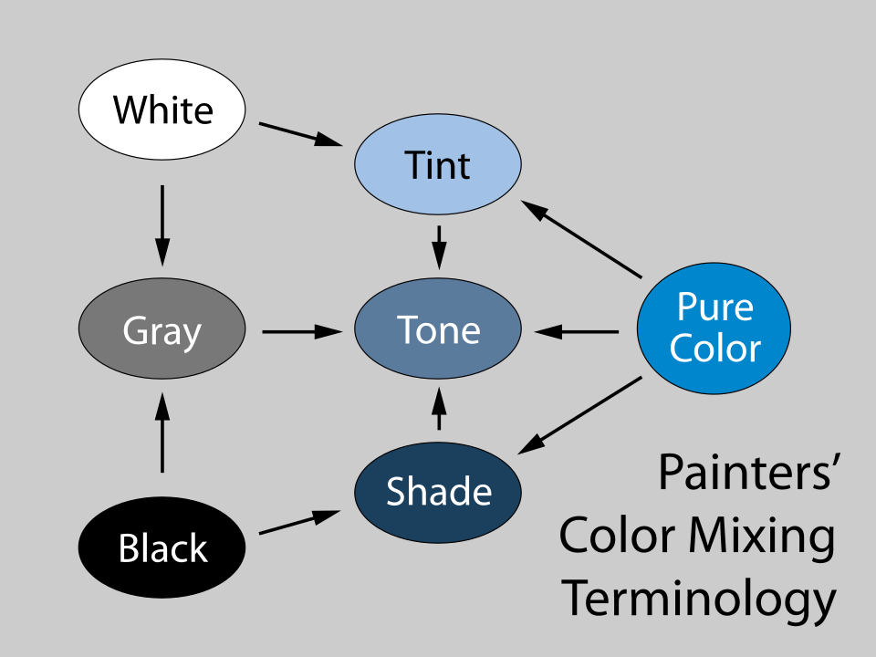

> **Hạn chế của biểu đồ phẳng:** Biểu đồ CIE 1931 `(x, y)` hoàn toàn "mù" độ sáng. Vì vậy, khi bạn làm Shade một màu **Xanh dương (Blue)** rực rỡ để biến nó thành màu **Xanh Đen/Xanh hải quân (Navy Blue)** tối tăm, thì **tọa độ `(x, y)` của cả hai màu này vẫn nằm trùng khít lên nhau tại một điểm duy nhất**. Trên không gian 2D, màu **Xanh Đen/Xanh hải quân (Navy Blue)** thực chất chỉ là một màu **Xanh dương (Blue)**... thiếu sáng.

#### Sự "xung đột" thuật ngữ trên giao diện phần mềm (UI)

Khi làm Color Grading (trong Lightroom, DaVinci Resolve,...), cụm từ **Tint** lại bị biến đổi hoàn toàn ý nghĩa:

- Phần mềm hoàn toàn không có thanh trượt Shade.
- Thanh trượt **Tint** trong phần mềm được định nghĩa thành trục đối ngẫu: **Xanh lá (Green) ↔ Hồng/Tím (Magenta)**.

Bản chất của tên gọi này là một cách mượn chữ của các kỹ sư. Khi một bức ảnh bị ám xanh lá do đèn nhân tạo, Điểm Trắng bị đẩy lệch lên trên. Phần mềm bắt ta cộng thêm sắc Magenta đối nghịch để kéo Điểm Trắng đó **quay ngược trở lại tâm trắng trung tính**. Hành động kéo một điểm màu từ rìa bão hòa về lại tâm trắng để nó nhạt đi, xét về mặt toán học đồ thị, chính là phép toán **Pha Trắng (Desaturation)**. Vì thế, thanh trượt Green/Magenta này mới được đặt tên là Tint.

#### Hệ trục tọa độ cục bộ của thanh công cụ White Balance

Khi gộp toàn bộ lại, hai thanh trượt kinh điển trong phòng hậu kỳ thực chất đang vẽ nên một **hệ trục tọa độ 2D cục bộ** bao quanh Điểm Trắng (White Point):

- **Thanh trượt Temperature:** Di chuyển Điểm Trắng chạy dọc theo "đường ray" vật lý **Planckian Locus** (Xanh dương ↔ Vàng).
- **Thanh trượt Tint (trong phần mềm):** Di chuyển Điểm Trắng theo hướng **vuông góc 90 độ** với đường ray Planckian đó (Green ↔ Magenta) để bù trừ sai lệch của ánh sáng nhân tạo.

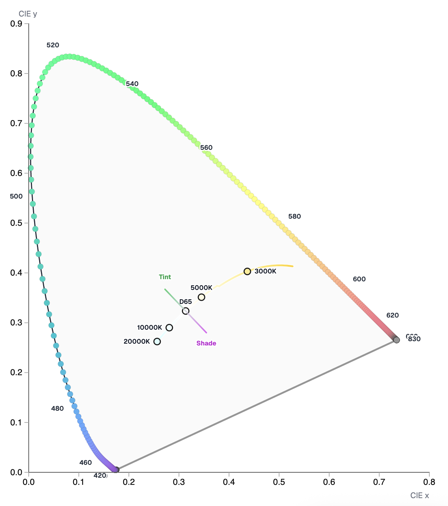

Một khi bộ đôi này định vị được chính xác tọa độ Điểm Trắng tham chiếu mới, thuật toán của phần mềm mới có một cái "mỏ neo" vững chắc để tự động tính toán ra toàn bộ dải màu **Tint (pha trắng hướng tâm)** và **Shade (pha đen giảm sáng)** cho từng pixel trong bức ảnh.

Giá trị của nhiệt độ màu là vô hạn, nên thường người ta sẽ giới hạn tới `50000 K` để tránh phức tạp.

#### Chromatic Adaptation: Phép "bẻ cong" không gian của bộ não và thuật toán

Đến đây, chúng ta vấp phải một nghịch lý hình học: Khi kéo hai thanh trượt `Temperature` và `Tint` để chọn một tọa độ Điểm Trắng mới (ví dụ chuyển từ `D65` sang `D55`), toàn bộ thế giới màu sắc xung quanh sẽ biến đổi ra sao?

Trong sinh học, hiện tượng này được gọi là **Chromatic Adaptation (Sự thích ứng sắc giác)**. Khi ta bước từ ngoài nắng vào một căn phòng ngập ánh đèn vàng, võng mạc và não bộ của ta mất khoảng vài giây để _"re-calibrate" (tái thiết lập)_. Não bộ sẽ ép góc nhìn của mắt phải coi ánh sáng vàng trong phòng là màu trắng trung tính mới. Để bảo toàn nhận thức, não bộ tự động "bẻ cong" cách chúng ta cảm nhận tất cả các màu sắc khác xung quanh: màu đỏ sẽ bị đẩy sang một sắc độ khác, màu xanh dương cũng bị co giãn theo hệ quy chiếu mới.

Trong Color Science, các phần mềm hậu kỳ không thể để mắt người tự điều tiết khi nhìn vào một khung hình kỹ thuật số cố định. Thuật toán bắt buộc phải giả lập lại quyền năng sinh học này của bộ não bằng toán học phẳng:

- **Dịch chuyển và Co giãn Không gian:** Khi Điểm Trắng thay đổi, thuật toán không chỉ đơn thuần là tịnh tiến một chấm tròn trên đồ thị. Nó sử dụng các ma trận chuyển đổi kinh điển (như _Von Kries_, _Bradford_, hoặc _CAT02_) để **xoay, nén, và co giãn toàn bộ hình móng ngựa CIE 1931 lẫn tam giác giới hạn Gamut xung quanh tâm mỏ neo mới**.
- **Hệ quả hình học:** Một màu sắc có tọa độ `(x, y)` cố định ban đầu dưới ánh sáng D65, khi qua phép biến đổi thích ứng sắc giác sang hệ quy chiếu D55, nó sẽ bị "văng" sang một tọa độ `(x, y)` hoàn toàn mới. Đây chính là lý do vì sao khi ta đổi White Balance, không chỉ vùng trắng thay đổi mà toàn bộ sắc diện da người (_skintone_), màu lá cây, hay sắc độ bầu trời trong file phim của ta đều đồng loạt chuyển dịch theo một tỷ lệ tuyến tính cực kỳ chặt chẽ.

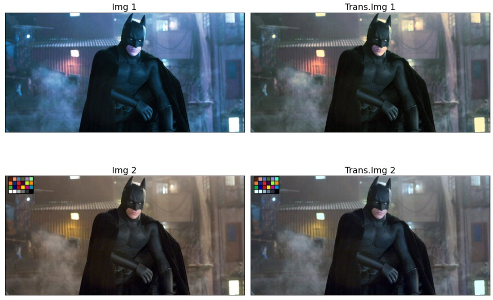

Suy cho cùng, Cân bằng trắng không phải là một bộ lọc màu (_color filter_) đè lên hình ảnh; nó là một **phép đổi trục tọa độ không gian** để tái lập lại cách con người nhận thức thế giới.

#### Ứng dụng trong thực tế của White Balance trên camera

Chắc các bạn đã từng nghe qua cụm từ "White Balance" trên camera, nhất là những người hay chơi công thức màu (recipe) như của Fujifilm. Ví dụ như `Daylight`, `Cloudy`, `Tungsten`, `Fluorescent`,... Tuy nhiên, đây chỉ là những giá trị nhiệt độ màu (Color Temperature) mà camera sử dụng để cân bằng trắng theo công thức màu của nhà sản xuất.

_Lưu ý: Preset **Shade** trên máy ảnh chỉ ám chỉ chụp trong bóng râm, không liên quan tới **Shade (pha đen)** trong lý thuyết màu ở phần trên._

| Preset trên Máy ảnh    | Tình huống thực tế (Fujifilm Chart)       | Bản chất Vật lý & Tọa độ trên CIE 1931                                                                                                                 | Cơ chế bù trừ của Thuật toán                                                                                                                  |
| ---------------------- | ----------------------------------------- | ------------------------------------------------------------------------------------------------------------------------------------------------------ | --------------------------------------------------------------------------------------------------------------------------------------------- |
| **Tungsten**           | Đèn điện trong nhà                        | Nhiệt độ màu thấp `(3000 K)`. Điểm trắng lùi sâu về phía **đuôi Vàng/Cam** của đường cong Planckian.                                                   | Đổ thêm sắc **Xanh Dương (Blue)** để kéo bức ảnh về trạng thái trung tính.                                                                    |
| **Daylight**           | Chụp dưới ánh nắng trực tiếp              | Ánh sáng nắng trưa tự nhiên `(5200 K - 5600 K)`. Điểm trắng nằm ở **vị trí cân bằng lý tưởng** trên đồ thị.                                            | Giữ nguyên hệ quy chiếu, ít đòi hỏi các phép co giãn ma trận cực đoan.                                                                        |
| **Cloudy** / **Flash** | Chụp dưới trời nhiều mây / Dùng đèn flash | Ánh sáng bị tán xạ qua mây hoặc đèn flash cường độ cao `(6000 K)`. Điểm trắng dịch nhẹ về **phía Xanh Dương** của đường cong.                          | Phủ một lớp màu **Ấm (Amber/Vàng)** nhẹ lên bức ảnh để bảo vệ sắc diện da người.                                                              |
| **Shade**              | Chụp trong bóng râm của tòa nhà           | Ánh sáng phản xạ từ bầu trời xanh trong bóng râm, nhiệt độ màu vọt lên rất cao `(7000 K - 9000 K)`. Điểm trắng dạt hẳn sang **vùng Xanh Dương gắt**.   | Bù trừ một lượng sắc **Vàng/Cam rất lớn** để kéo toàn bộ bức ảnh ấm áp trở lại.                                                               |
| **Fluorescent**        | Đèn huỳnh quang / compact fluorescent       | Đèn phát sáng bằng kích thích khí trơ, tạo ra đỉnh phổ đột biến. Tọa độ bị **lệch hoàn toàn khỏi đường cong Planckian** về phía Xanh Lá.               | Kích hoạt trục Tint vuông góc, đẩy tâm về vùng **Green** để thuật toán phủ sắc **Magenta (Hồng/Tím)** đối ngẫu xuống triệt tiêu sắc xanh bẩn. |
| **Auto (AWB)**         | Cân bằng trắng tự động                    | Máy ảnh liên tục phân tích biểu đồ histogram của môi trường theo thời gian thực.                                                                       | Tự động "dò đường" trên đồ thị để tìm ra tọa độ `(x, y)` tối ưu nhất cho cả hai trục Temp và Tint.                                            |

## Tham khảo

- CIE, [CIE 1931 colour-matching functions, 2 degree observer](https://cie.co.at/datatable/cie-1931-colour-matching-functions-2-degree-observer)
- Reddit, [How do cone and rod cells in our eyes work?](https://www.reddit.com/r/biology/comments/ulir6k/how_do_cone_and_rod_cells_in_our_eyes_work/)
- Evo-ed, [Cell Biology](https://evo-ed.org/primate-color-vision/biological-processes/cell-biology/)
- RP Photonics, [Color Spaces](https://www.rp-photonics.com/color_spaces.html)
- HyperPhysics, [CIE Color System](http://hyperphysics.phy-astr.gsu.edu/hbase/vision/cie.html)
- American Academy of Ophthalmology, [Cones](https://www.aao.org/eye-health/anatomy/cones)
- National Library of Medicine, [The evolution of concepts of color vision](https://pmc.ncbi.nlm.nih.gov/articles/PMC3095437/)
- Santha Lakshmi Narayana, [Chromatic Adaptation](https://santhalakshminarayana.github.io/blog/chromatic-adaptation)
- David Heeger, [Perception Lecture Notes: Color](https://www.cns.nyu.edu/~david/courses/perception/lecturenotes/color/color.html)
