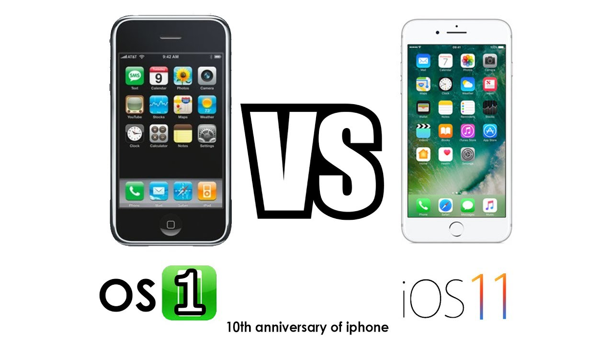

Hồi mới tìm hiểu design, mình cứ nghĩ UI (_User Interface_) làm công việc mang tính thẩm mỹ cho giao diện. Càng tìm hiểu, mới thấy trong nghệ thuật thiết kế thì tính thẩm mỹ là một trong số các tính chất chứ không phải là yêu tố chính. Quan trọng là **thiết kế phải giải quyết được vấn đề**. Chúng ta cùng đi vào nội dung.

## Những điều cơ bản

Những điều cơ bản này, mình tóm gọn lại từ bài "UI Design Fundamental" của bác Tony Le (Quang Phowr).

- Thiết kế phải có mục đích
- Giao diện không có người dùng, không phải là giao diện người dùng
- 3 tính chất của UI Design

### Thiết kế phải có mục đích

> Ai là đối tượng mà trang web muốn hướng đến? Mục đích của họ đến trang web là gì?
>
> **Tony Le**

Để xác định được người dùng và mục đích của họ, ta có nhiều phương pháp

#### Quy trình

- **Quy trình thác nước (Waterfall model)**  
  Đây là quy trình cổ điển trong ngành Công nghệ phần mềm (Software Engineering). Bạn làm rõ yêu cầu, thiết kế, thực thi và kiểm thử. Bước nào thấy sai sai thì quay lại. Và kết quả là nó khá tốn thời gian và chi phí vận hành khá tốn kém về thời gian lẫn tiền bạc.

  

- **Quy trình xoắn ốc (Spiral model)**  
  Quy trình này được cải tiến hơn, bạn chia nhỏ công việc ra từng giai đoạn, giai đoạn sau sẽ làm tiếp việc giai đoạn trước. Tuy nhiên, người dùng vẫn phải chờ đợi phía phát triển làm xong hết mới thấy được mặt mũi để góp ý.

  

- **Mô hình hướng người dùng làm trung tâm (User Centered Design model)**  
  Hiện nay, đa số các designer thích dùng mô hình này. Do giúp hiểu được người dùng hơn, được người dùng đóng góp ý kiến sớm và chi phí thấp.

  

  Đối với quy trình này, có 2 bước quan trọng bạn cần làm. Sau khi làm xong sẽ trả lời được câu hỏi của bác Tony đặt ra.

  - "Phân tích người dùng" aka _Ai sử dụng hệ thống này_
  - "Phân tích nghiệp vụ của người dùng" aka _Người dùng cần gì_

#### Phân tích người dùng

Mục đích là xác định ai là người sử dụng. Bạn có thể dựa theo những mục tiêu gợi ý dưới đây:

- Độ tuổi, giới tính, văn hoá, ngôn ngữ
- Kinh nghiệm dùng máy tính, thiết bị thông minh
- Tần suất sử dụng
- Giới hạn vật lý
- Trình độ học vấn
- Động lực sử dụng
- Môi trường làm việc
- Quan hệ xã hội
- vân vân và mây mây

#### Phân tích nghiệp vụ

Bạn cần đạt được 3 mục tiêu sau đây

- Cần gì để hoàn thành nghiệp vụ? (mục tiêu)
- Điều kiện gì để hoàn thành nghiệp vụ (điều kiện tiên quyết)
- Các bước thực hiện (nhiệm vụ)

### Giao diện không có người dùng, không phải là giao diện người dùng

Ý này cũng đơn giản, tức là bạn thiết kế một giao diện mà người dùng không thể sử dụng được là một bản thiết kế bỏ đi. Bạn làm được công việc phía trên là đã đủ dữ liệu để thiết kế một giao diện mà người dùng có thể chấp nhận xài được.

### 3 tính chất của UI

#### Tính thẩm mỹ

Thú thật thì mười người, mười một ý. Cái đẹp có thể thay đổi theo thời gian, và nó phải hợp thời. Bạn nên đi theo xu hướng của thời đại thì giao diện ắt sẽ đẹp.

Năm viết bài này là 2018. Bạn thử xem xu hướng nó như thế nào. [https://icons8.com/articles/popular-ui-design-trends-dribbble/](https://icons8.com/articles/popular-ui-design-trends-dribbble/).

#### Nội dung

Nếu bạn có sử dụng chữ trong thiết kế, trước tiên là nó phải liên quan và có cấu trúc với hình ảnh sử dụng. Nội dung phải dễ tìm và đơn giản.

`"Người dùng" trong "ngữ cảnh" đó, họ cần "nội dung" gì.`

Để nâng cao kỹ năng này, bạn có thể đọc qua cuốn ["Ý tưởng này là của chúng mình"](https://tiki.vn/y-tuong-nay-la-cua-chung-minh-p375208.html) của Huỳnh Vĩnh Sơn hoặc GAM7.

#### Tính tương tác

Các hành động như chạm, vuốt, nhấn, click,... lên thiết bị để thực hiện hành động nào đó trên giao diện. Các hành động đó chính là tương tác với giao diện. Khi ta tương tác, chúng có đem lại cảm xúc/ cảm giác cho người dùng.

### Ghi nhớ

- Thiết kế cái gì đó phải có mục đích cụ thể, rõ ràng
- UI Designer là người lập kế hoạch, không phải người sáng tạo

## Các thành phần cơ bản của UI

Phần này sẽ nói về các component/khái niệm thường được sử dụng trong thiết kế giao diện.

### Bố cục (Layout)

Trước khi bạn thiết kế bất cứ cái gì, cần thể hiện trước bố cục của tác phẩm để dễ dàng kiểm tra có hợp với yêu cầu của người dùng hay không, có thuận tiện cho team dev hay không,... Để căn chỉnh ngay hàng thẳng lối, bạn có thể dùng khái niệm Grid để chia bố cục. Thường là chuẩn 12 cột.

### Chữ (Typography)

Làm việc với con chữ là một nghệ thuật. Có khi bạn mất cả ngày trời để tìm font chữ sao cho phù hợp với thiết kế. Tuy nhiên có một khái niệm cần làm rõ:

`Font = Type-face + Type-style + Size`

Type-face ở đây là Arial, Times New Roman, Helvetica,... còn Type-style là bold, italic,... Nếu bạn đi sâu hơn, sẽ xuất hiện một số khái niệm khác như kerning, serif, stroke, spline,...

### Màu sắc

Bạn có thể phối màu theo những cách cổ điển như màu đối xứng, màu tam giác,... hoặc tìm hiểu cách phối màu theo xu hướng như màu Pantone, Material Design,... Nhưng cách mình thích nhất là copy phong cách của người mình thích để dần cải thiện kỹ năng dùng màu. Android Jones là một trong số nghệ sĩ mình thích.

### Hình ảnh

Có một thuyết thấy cũng khá hợp lý - "Hình ảnh nói lên câu chuyện". Dưới đây là một số lưu ý khi dùng hình ảnh:

- Không dùng hình ảnh sáo rỗng
- Nhớ kiểm tra bản quyền hình ảnh trước khi sử dụng
- Sử dụng hình ảnh phải liên quan đến khán giả
- Lưu ý kích thước và độ phân giải

## Có thể bạn thừa biết?

### Tìm nguồn tham khảo về UI Design ở đâu?

Dưới đây là một số nguồn để bạn có thể tìm cảm hứng.

- [https://www.behance.net/](https://www.behance.net/)
- [https://dribbble.com/](https://dribbble.com/)
- [https://www.awwwards.com/](https://www.awwwards.com/)
- [https://www.pinterest.com/](https://www.pinterest.com/)
- [https://www.tumblr.com/](https://www.tumblr.com/)
- [https://www.deviantart.com/](https://www.deviantart.com/)

## Tham khảo

- Mạnh Cường, [Typography cơ bản #2 – cơ thể con chữ ( type anatomy )](https://toihocdohoa.com/blog/typography-phan-2-co-con-chu-type-anatomy/)
- Mạnh Cường, [Typography cơ bản #3 – Type, Face, fFont …và gì nữa ?](https://toihocdohoa.com/blog/typography-phan-3-phan-biet-font-vs-typeface-cac-ho-typeface-co-ban/)
- Jen Simmons, [Everything About Web Design Just Changed](https://speakerdeck.com/jensimmons/everything-about-web-design-just-changed)
- Quang Phowr, [UI Design Fundamental](https://www.slideshare.net/eggcellent/ui-design-fundamental/)
- Salena Poussard, [9 Golden Rules of Choosing Images for Your Website](https://oscwebdesign.biz/website-design/rules-choosing-images-website/)
