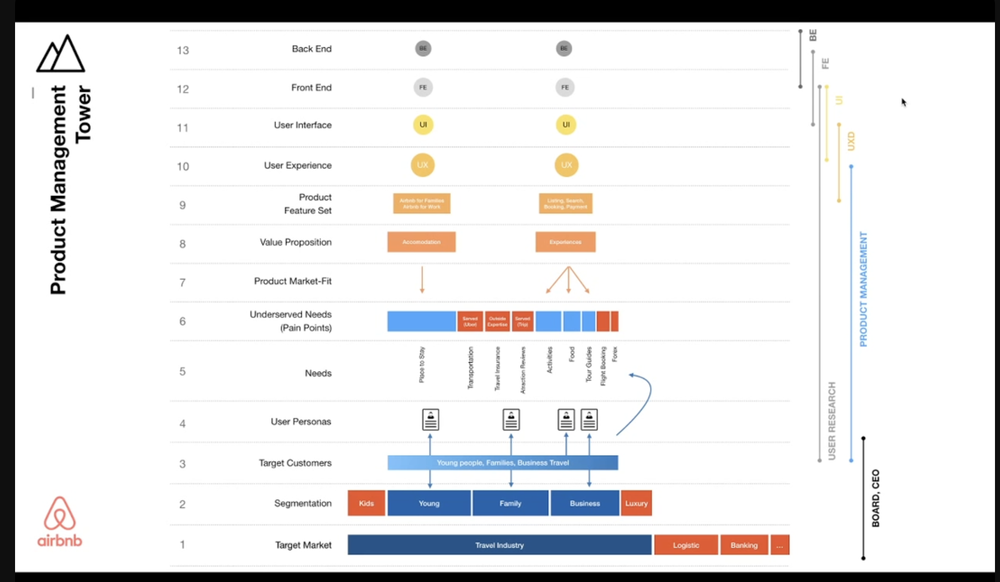

Hồi còn làm ở 2359 Media, có bữa ngồi tán dóc với khứa [Melvyn](https://www.linkedin.com/in/melvynkee/) về việc mình thích thiết kế Design System/UI và code ra nó giống như mấy công ty product lớn. Nhưng không có công ty nào tuyển làm việc này, nên là chọn làm Front-End Developer. Thấy vậy, khứa nói có tồn tại vị trí đó, tên là `UX Engineer`.

## Hiểu về Design System

> Trên lý thuyết, hệ thống thiết kế xoay quanh việc thiết kế theo một cách có hệ thống. Nó bao gồm những thành phần từ cơ bản nhất đến nâng cao nhất của một thiết kế, kèm theo các quy chuẩn về cách sử dụng chúng để tạo ra một thiết kế. Màu sắc, mặt chữ, hình dạng, kích cỡ, điều khiển, bảng biểu, v.v. là những đặc tính mà thiết kế nào cũng dùng.
>
> -- <cite>Ref: [Hệ thống thiết kế (Design system)](https://uxlagi.com/#!#25)</cite>

### Designer và Design System

Designer chịu trách nhiệm tạo ngôn ngữ hình ảnh cho hệ thống, như là màu sắc, con chữ, khoảng trống, lưới,... Trong ngữ cảnh Design System, họ tạo ra những thành phần _(component)_ có thể tái sử dụng được cho nhiều màn hình khác nhau một cách linh hoạt, có thể mở rộng và nhất quán trong ngôn ngữ thiết kế.

### Developer và Design System

Developer chuyển đổi các thành phần tái sử dụng ở dạng thiết kế sang dạng code. Họ đảm báo tính đúng đắn, hiệu năng, khả năng tiếp cận trong nhiều ngữ cảnh sử dụng khác nhau cũng như phải dễ bảo trì, mở rộng.

## Sự xuất hiện của UX Engineer

Mình sẽ dùng hình minh họa dưới đây trong video về [Product Management for Managers](https://www.youtube.com/live/kMLgug3GrkU?si=aufRVFopiTU0hvud) của anh HiếuTV.

Như định nghĩa về vai trò của Designer và Developer ở phía trên, Designer sẽ làm phần `UXD` và Developer sẽ làm phần `FE` (chỉ xoay quanh Design System). Khi một dự án đủ lớn, chúng ta sẽ cần một vai trò làm cầu nối giữa `UXD` và `FE`.

Thực tế, các công ty thường tuyển Designer và Developer chỉ tập trung vào chuyên môn, nên là khi triển khai Design System sẽ không đạt được tính tái sử dụng, dễ mở rộng, không thống nhất. Designer vẽ phù hợp với yêu cầu, nhưng không thông nhất hành vi tương tác với nhưng chỗ khác, hoặc là vẽ xong Developer không code được. Còn phía Developer đụng đâu code đó, không có tái sử dụng được, không biết cách tổ chức code cho dễ mở rộng theo thiết kế.

Do đó, vị trí `UX Engineer` được ra đời để làm cầu nối giữa designer và developer.

## Tham khảo

- Team FUNCTION12, [Unraveling the Roles: Designer vs Developer in Design Systems](https://blog.function12.io/tag/design-systems/unraveling-the-roles-designer-vs-developer-in-design-systems/)
- UX là gì, [Hệ thống thiết kế (Design system)](https://uxlagi.com/#!#25)
