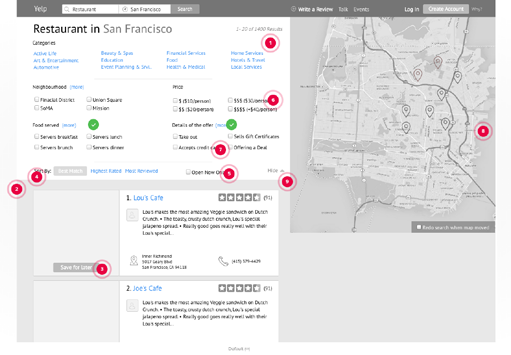

## Lời người dịch

Sẵn dịp đọc cuốn "[The Guide to Wireframing](http://studio.uxpin.com/ebooks/guide-to-wireframing/)" nên mình lược dịch và thêm thắt một số chỗ để có thêm tài liệu tham khảo bằng tiếng Việt. Mình sẽ chia cuốn sách ra làm nhiều phần để mọi người tiện theo dõi. Có một số từ tiếng Anh mình sẽ để nguyên vì dịch ra tiếng Việt rất "bưởi".

Danh sách bài viết trong loạt bài:

- Phần 1: Một góc nhìn thực tế về Wireframe
- [Phần 2: Các sắc thái của Wireframe](https://vhnam.github.io/tutorials/wireframe-trong-thiet-ke-san-pham-phan-2)
- [Phần 3: Mẫu thiết kế](https://vhnam.github.io/tutorials/wireframe-trong-thiet-ke-san-pham-phan-3)
- [Phần 4: Nguyên tắc thiết kế wireframe](https://vhnam.github.io/tutorials/wireframe-trong-thiet-ke-san-pham-phan-4)

## Sơ lược

[Wireframe](https://en.wikipedia.org/wiki/Website_wireframe) là một công cụ quan trọng trong quá trình thiết kế và phát triển sản phẩm. Khi tạo ra một sản phẩm, wireframe là bản thiết kế giúp developer, product manager và designer có thể nói chuyện được với nhau. Và mỗi khi có gì thay đổi về giao diện thì dễ dàng, nhanh chóng để mọi người có thể hiểu và thực hiện. Wireframe có thể được thực hiện nhanh trên giấy hoặc là máy tính.

## Ai sử dụng wireframe?

Bất kỳ ai tham gia phát triển sản phẩm đều có thể sử dụng wireframe, chẳng hạn như là [Business Analyst](https://en.wikipedia.org/wiki/Business_analyst), [Information architect](https://en.wikipedia.org/wiki/Information_architecture), [User Experience Designer](https://en.wikipedia.org/wiki/User_experience_design),...

Những phần sau sẽ nói chi tiết về cách sử dụng wireframe của từng người trong team và các công cụ thiết kế wireframe.

## Tại sao bất cứ ai cũng nên sử dụng wireframe?

Wireframe có thể hiểu là bản thiết kế. Bản thiết kế này thể hiện các thông tin cơ bản, giao diện của một trang web hoặc ứng dụng di động. Mọi người tham gia phát triển nói có thể góp ý, sửa lỗi khi nói về chi tiết của từng trang.

- **Cấu trúc (Structure)** - Header, sidebar, footer, bảng thống kê,... được đặt như thế nào?
- **Nội dung (Content)** - Trang này sẽ hiện cái gì lên?
- **Hệ thống phân cấp thông tin (Informational hierarchy)** - Tổ chức thông tin và cách hiển thị?
- **Chức năng (Functionality)** - Giao diện thể hiện chức năng ra sao?
- **Cách ứng xử (Behavior)** - Cách người dùng tương tác với giao diện.

Wireframe không bao gồm việc thể hiện chi tiết giao diện như màu sắc, nội dung hình ảnh, nhận dạng,...

## Tại sao tui nên sử dụng wireframe?

Cho dù mục đích sử dụng wireframe có là gì? Có được phác thảo trên giấy, hay mấy công cụ chuyên dụng, hình ảnh là một hộp màu xám hay là hình ảnh,... thì nó cũng truyền tải thông tin. So với các phương pháp khác như [Mock Up](https://en.wikipedia.org/wiki/Mockup), [Visual Design](https://en.wikipedia.org/wiki/Graphic_design) thì vẽ wireframe vẫn là sự lựa chọn tốn ít thời gian nhất để thể hiện thông tin trên giao diện cho người khác.

### Sự tương tác và UX Designer, Information Architect

UX Designer và Information Architect sử dụng wireframe để thể hiện cách thao tác của người dùng giữa các màn hình. Thường là họ sẽ kết hợp wireframe với [Flow Chart](https://en.wikipedia.org/wiki/Flowchart), [Storyboard](https://en.wikipedia.org/wiki/Storyboard).

Như hình dưới, bạn sẽ thấy được những thông tin cơ bản, chức năng có trên màn hình, cách người dùng sẽ tương tác, hệ thống phân cấp thông tin. Sau đó, kết quả sẽ được đưa sang Graphic Designer.

### Graphic Designer

Graphic Designer sẽ dựa vào wireframe để tạo ra các bản mockup với giao diện chi tiết, [prototype](https://en.wikipedia.org/wiki/Software_prototyping) thể hiện cách tương tác để ra bản thiết kế cuối cùng. Bước này sẽ kết hợp với các bản phác họa, storyboard và wireframe.

Khi wireframe đưa tới họ, bạn sẽ thấy nội dung chi tiết của màn hình được thể hiện từ kết quả của UX Designer và Information Architect.

### Developer

Developer sẽ nhìn vào wireframe để biết có bao nhiêu các chức năng cần thực hiện. Front-End Developer nhìn vào sẽ biết code giao diện như thế nào. Back-End Developer sẽ biết có các chức năng gì để viết phần xử lý.

### Business Analysts

Business Analysts dùng wireframe để đảm bảo đúng giao diện thể hiện đúng nghiệp vụ, cách tương tác trên màn hình một cách trực quan.

### Bộ phận kinh doanh

Bộ phận này ý nói đến Product Manager, Project Manager,... dùng wireframe để kiểm tra lại đã đảm bảo yêu cầu của khách hàng, các đối tượng thể hiện trên bản thiết kế nhằm điều chỉnh chiến lược của sản phẩm.

### Các bên liên quan

Bộ này này gồm khách hàng, partner,... Họ nhìn vào wireframe để đảm bảo bên thiết kế đã làm đúng như trong thỏa thuận.

Wireframe đưa đến những người này thì phải đảm bảo rõ ràng, sạch sẽ vì họ còn công việc của mình nên cần review một cách nhanh chóng để tránh lãng phí thời gian.

## Kết thúc phần một

Chốt lại phần 1, bạn sẽ hình dung được mọi người sẽ sử dụng wireframe như thế nào, nó có lợi gì. Mình cũng chia sẻ vấn đề của mình liên quan đến wireframe.

Thường thì đa số các bạn sinh viên có thói quen nhảy thẳng vào code giao diện, không có thiết kế. Lâu ngày thành thói quen, nếu bạn có mong muốn làm **startup** thì bạn cũng đâm đầu vào code. Một ngày đẹp trời, bạn thấy nó xấu và muốn sửa thì... đó là một bộ phim kinh dị. Sau này rút kinh nghiệm, vẽ chi tiết giao diện trước bằng [Adobe Illustrator](http://www.adobe.com/products/illustrator.html), [Adobe Photoshop](http://www.adobe.com/products/photoshop.html),... người ta hay gọi là mockup. Đỡ hơn nhưng mà nó vẫn rắc rối. Vì thế, hãy vẽ wireframe cho nó đơn giản. Công cụ thì mình sẽ đề cập ở một phần khác. Nói chung thì mình vẽ wireframe cũng lẹ.. khoảng 10 phút là có khoảng gần cả chục bản giao diện. Rồi lọc ra để vẽ mockup. Cuộc đời nó thêm được tí màu hồng.

## Tham khảo

- [The Guide to Wireframing for designers, PMs, engineers and anyone who touches product](http://studio.uxpin.com/ebooks/guide-to-wireframing/)
