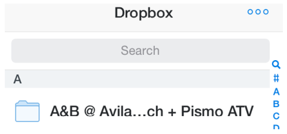
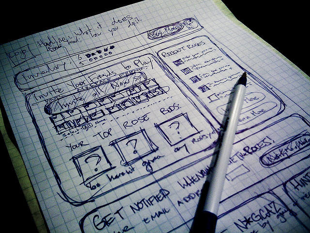
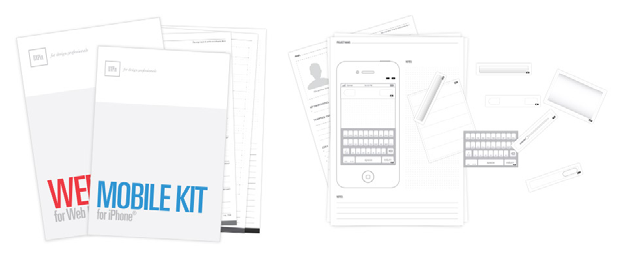
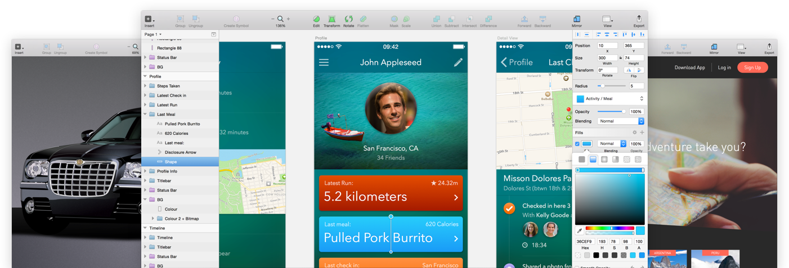
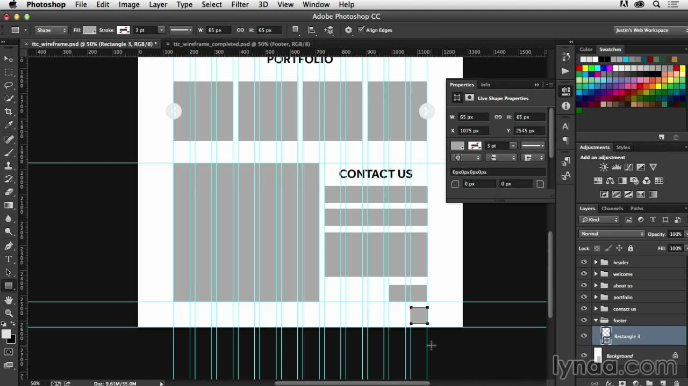
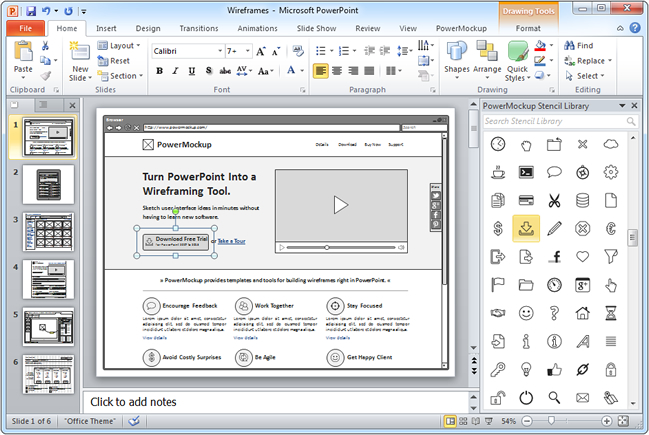
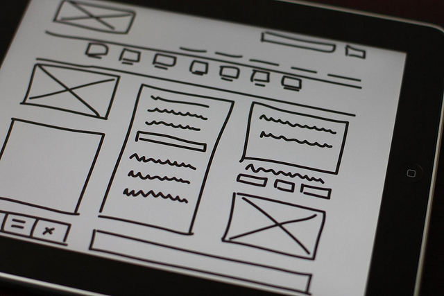
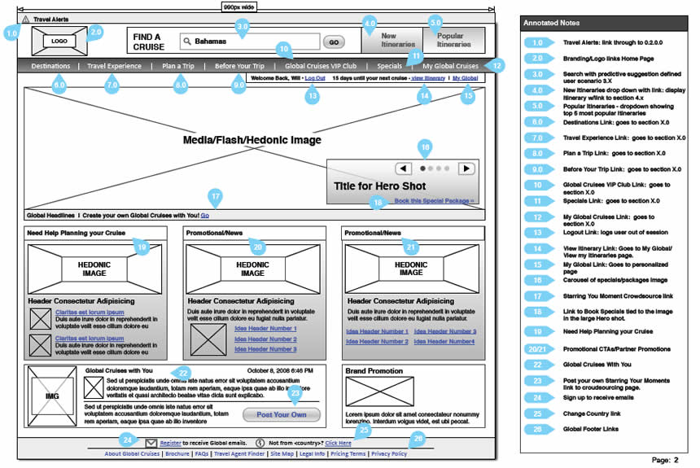

## Lời người dịch

Tiếp tục phần 1 trong loại bài lược dịch của cuốn "[The Guide to Wireframing](http://studio.uxpin.com/ebooks/guide-to-wireframing/)" tại [đây](http://vhnam.github.io/blog/wireframe-trong-thiet-ke-san-pham-phan-1/).

Danh sách bài viết trong loạt bài:

- [Phần 1: Một góc nhìn thực tế về Wireframe](https://vhnam.github.io/tutorials/wireframe-trong-thiet-ke-san-pham-phan-1)
- Phần 2: Các sắc thái của Wireframe
- [Phần 3: Mẫu thiết kế](https://vhnam.github.io/tutorials/wireframe-trong-thiet-ke-san-pham-phan-3)
- [Phần 4: Nguyên tắc thiết kế wireframe](https://vhnam.github.io/tutorials/wireframe-trong-thiet-ke-san-pham-phan-4)

## Các sắc thái của wireframe

Sau khi đọc xong phần 1, các bạn đã biết ai sử dụng wireframe, sử dụng vào mục đích gì, cách sử dụng wireframe trong làm việc nhóm. Bây giờ, chúng ta sẽ đi vào tìm hiểu các sắc thái của wireframe, các mức độ chi tiết mà bạn có thể trình bày và làm thế nào để ràng buộc các chi tiết với nhau. Trước hết, chúng ta cần nhớ lại người ta cần gì ở wireframe.

- **Cấu trúc (Structure)** - Header, sidebar, footer, bảng thống kê,... được đặt như thế nào?
- **Nội dung (Content)** - Trang này sẽ hiện cái gì lên?
- **Hệ thống phân cấp thông tin (Informational hierarchy)** - Tổ chức thông tin và cách hiển thị?
- **Chức năng (Functionality)** - Giao diện thể hiện chức năng ra sao?
- **Cách ứng xử (Behavior)** - Cách người dùng tương tác với giao diện.

## Chọn phong cách cho wireframe của bạn

Có thể chỉ có một vài mẫu wireframe mà bạn thường xài. Nhưng nếu bạn để ý các biến thể, các mức độ chi tiết thì có thể hơn 50 loại. Phần này dựa trên bài viết [The Aesthetics of Wireframes and the Importance of Context](http://designmodo.com/aesthetics-wireframes-context/) nhưng sẽ đi sâu hơn.

Không biết các bạn có nhận ra điều này không? Mỗi cách đổ bóng, đường thẳng, kí tự, hình ảnh, sự tương tác mà bạn thêm vào wireframe sẽ ảnh hưởng tới cách nhìn nhận của người dùng về sản phẩm. Wireframe là một ngôn ngữ dùng cho thiết kế sản phẩm và phát triển. Nhưng vài năm gần đây, có một số người đánh đồng **wireframe** với **sketch**, **mockup** và **prototype**.

### Công cụ và phương tiện

Có thể có một số người đồng ý hoặc không đồng ý với các công cụ để vẽ wireframe dưới đây. Nhưng kệ nó đi, miễn là vẽ được là vẽ.

#### Phác thảo

Bạn có thể phác thảo wireframe bằng bút chì, bút màu,... trên giấy, trên bảng. Cách này đơn giản và nhanh chóng, giúp mạch suy nghĩ của ta không bị gián đoạn bởi cách xài các công cụ.

#### Cắt ra giấy

Bạn có thể sử dụng [bộ công cụ giấy wireframe chuẩn](https://www.uxpin.com/web-kit.html) để làm. Đơn giản hơn, bạn có thể tự vẽ rồi cắt chúng ra.

#### Phần mềm vẽ wireframe

Có rất nhiều phần mềm để bạn lựa chọn, như là [Axure RP](http://www.axure.com/), [Balsamiq](https://balsamiq.com/), [Sketch](https://www.sketchapp.com/),...

#### Phần mềm thiết kế đồ họa

Có nhiều phần mềm thiết kế đồ họa (miễn phí và trả phí) có thể sử dụng được, nhưng phần lớn desginer thích dùng [Adobe Photoshop](http://www.adobe.com/products/photoshop.html), [Adobe Illustrator](http://www.adobe.com/products/illustrator.html).

#### Phần mềm thuyết trình

Hầu hết, mọi người đều sử phần mềm thuyết trình như [Apple Keynote](http://www.apple.com/mac/keynote/) hoặc [Microsoft PowerPoint](https://products.office.com/en-us/powerpoint). Bạn có thể tận dụng các **Shape** để tạo wireframe.

### Các mức độ trung thực

Bạn nên có những thay đổi về mức độ chi tiết và mục tiêu của wireframe.

#### Block diagrams

Block diagrams cung cấp các thông tin cơ bản nhất của một wireframe: bố cục, các loại nội dung hoặc các chức năng cơ bản mà bạn muốn thể hiện. Bạn có thể thiết lập hệ thống phân cấp thông tin, kiểu chữ, thêm văn bản, thay đổi kích thước để nhấn mạnh nội dung. Đừng đi quá chi tiết, nên thiết kế một cách tổng quát để không làm mất bố cục tổng thể của wireframe.

#### Grey boxes

Bạn có thể sử dụng các sắc thái của gam màu xám để nhấn mạnh bố cục và những phần mà bạn không có thời gian để lựa chọn màu sắc. Cách này giúp bạn dễ dàng kiểm tra được User Flows và cách tổ chức nội dung.

#### High-Fidelity Text

Cách này giúp wireframe của bạn chân thực hơn nhưng không đi quá sâu vào các chi tiết đồ họa. Rõ ràng hơn, điền những đoạn văn thật (không phải "lorem ipsum"), chiều dài đoạn văn, font chữ lý tưởng, kích thước,...

#### High-Fidelity Color

Đây là một cách khác để làm wireframe của bạn chân thực hơn mà không đi quá sâu vào các chi tiết đồ họa. Có nghĩa là bạn có thể thêm màu sắc vào background, nút, đoạn văn để nhấn mạnh hành động mong muốn hoặc User Flows. Nhưng bạn hãy sử dụng chúng một cách cẩn thận để tránh lãng phí thời gian và bị phân tâm những chi tiết. Người xem sẽ mất tập trung bởi màu sắc, có thể họ sẽ nghĩ bạn đang thiết kế một bản "mockup xấu tệ" hơn là wireframe.

#### High-Fidelity Media

Đây cũng là một cách khác để làm wireframe của bạn chân thực hơn mà không đi quá sâu vào các chi tiết đồ họa. Có nghĩa, bạn có thể chèn hình ảnh, video hoặc cái gì tương tự. Điều này cũng một phần giúp nhấn mạnh nội dung, tác động đến cấu trúc và hệ thống phân cấp thông tin tổng thể.

#### High-Fidelity Interactions

Đây cũng là một cách khác để làm wireframe của bạn chân thực hơn mà không đi quá sâu vào các chi tiết đồ họa. Đây là loại wireframe thường dùng để thể hiện sự tương tác. Ví dụ, hiện cửa sổ popup, mở rộng hoặc zoom nội dung, hiển thị cách trượt, cuộn, chạm và click. Bạn có thể xem ví dụ [Branded Website](http://eyzgmj.axshare.com/) được thiết kế bằng Axure RP.

### Chi tiết bổ sung

Bây giờ, bạn đã có thể lựa chọn công cụ thích hợp và rút ra được một số cách để thể hiện chi tiết của wireframe ở các mức độ phù hợp. Có một vài wireframe để hiểu được, bạn cần phải thể hiện thêm User Flows dùng hoặc là thể hiện sự tương tác.

#### Wireframe cơ bản

Thể hiện đúng mức độ chi tiết để xây dựng hoặc cải thiện sản phẩm.

- Bạn đang thiết kế bản thảo của một sản phẩm, đừng quá để ý nhiều đến những chi tiết nhỏ nhặt.
- Hãy để phần chi tiết cho Graphic Designer tự do sáng tạo.

#### Wireframe có chú thích

Ví dụ, mặc dù wireframe là cách nhanh nhất, dễ dàng nhất để thể hiện sự tương tác. Đôi khi, cần có thêm giải thích đi kèm khi có một hành động nào đó được kích hoạt.

#### Wireframe với User Flows

Wireframe đi kèm với flowchart ngày càng phổ biến. Nhìn vào đây, bạn biết được cách người dùng tương tác với giao diện ra sao.

## Kết luận

Phần này nói về những công cụ thiết kế wireframe, một số lưu ý khi thiết kế wireframe và đặc điểm một số loại wireframe thường dùng. Có một số phần mình đọc còn cảm thấy hơi mập mờ nên lược bỏ. Các bạn có thể đọc bản gốc để hiểu rõ hơn.

## Tham khảo

- [The Guide to Wireframing for designers, PMs, engineers and anyone who touches product](http://studio.uxpin.com/ebooks/guide-to-wireframing/)
