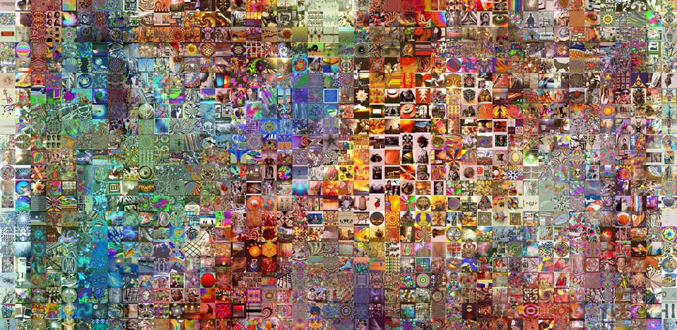
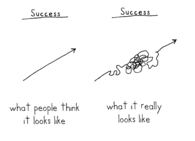
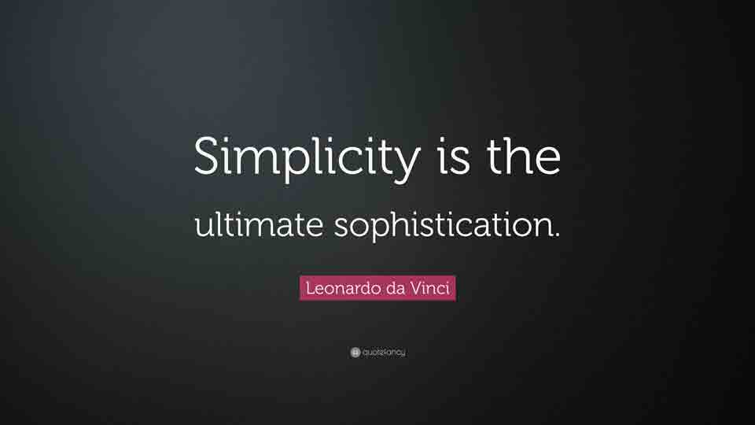

## Lời người dịch

Tiếp tục loạt bài lược dịch của cuốn "[The Guide to Wireframing](http://studio.uxpin.com/ebooks/guide-to-wireframing/)". Ở phần này có một số mình không tìm được nghĩa tiếng Việt tương tự nên sẽ để nguyên bản tiếng Anh.

Ở phần này có một số phần khó dịch sang tiếng Việt nếu dịch sát nghĩa. Mình xin lược dịch và thêm vào một số ý kiến cá nhân.

Danh sách bài viết trong loạt bài:

- [Phần 1: Một góc nhìn thực tế về Wireframe](https://vhnam.github.io/tutorials/wireframe-trong-thiet-ke-san-pham-phan-1)
- [Phần 2: Các sắc thái của Wireframe](https://vhnam.github.io/tutorials/wireframe-trong-thiet-ke-san-pham-phan-2)
- [Phần 3: Mẫu thiết kế](https://vhnam.github.io/tutorials/wireframe-trong-thiet-ke-san-pham-phan-3)
- Phần 4: Nguyên tắc thiết kế wireframe

## Dẫn nhập

Phần này sẽ cung cấp cho các bạn một số nguyên tắc cơ bản khi thiết kế wireframe. Lưu ý, hãy chú trọng vào quá trình, đừng quá tập trung vào một phần nào đó mà không dựa vào một nguyên tắc cụ thể để giúp bạn có câu trả lời đúng.

## Lập một chút kế hoạch và bắt đầu thực hiện

Phần quan trọng để cho ra đời một sản phẩm tốt là việc lên kế hoạch. Dưới đây là một số câu hỏi gợi ý trước khi đi sâu vào chi tiết:

- Ai là người dùng chính của sản phẩm?
- Người dùng cần gì và mục tiêu của họ khi sử dụng sản phẩm là gì?
- Để hoàn thành nghiệp vụ cần những gì và mục tiêu của chúng là gì?
- Có sản phẩm nào hoặc mẫu thiết kế nào tương tự đã giải quyết được nghiệp vụ hay dành cho người dùng hiện tại chưa?
- Giải pháp sẵn có vẫn còn thiếu những gì để hoàn thiện hơn?
- Đề xuất một số yêu cầu cho sản phẩm để phục vụ cho người dùng và nghiệp vụ.
- Những hạn chế của bạn là gì? (tiền, thời gian, kỹ năng,...)

Đừng bỏ quá nhiều thời gian, khi bạn vẽ sketching, wireframe và prototype sẽ giúp bạn hiểu hơn câu trả lời cho các câu hỏi phía trên. Nhưng đây là bước quan trọng để bạn định hình công việc sẽ làm.

## Đặt kỳ vọng - không chỉ mục tiêu

Có mục tiêu rõ ràng về những gì bạn đang cố gắng đạt được và cách đo lường chúng sẽ giúp bạn rất nhiều.

Intel và Google đã phổ biến thuật ngữ [Objective Key Results (OKRs)](https://weekdone.com/resources/objectives-key-results) - có lẽ nguồn từ mô hình [S.M.A.R.T](https://www.mindtools.com/pages/article/smart-goals.htm)[\[1\]](#note-1) để cung cấp hướng đi cho nhóm phát triển sản phẩm và các nhóm khác cùng tập trung vào phát triển sản phẩm tốt nhất.

Ngoài OKR và S.M.A.R.T, bạn nên đặt mục tiêu cụ thể cho từng bước. Ví dụ: thời gian thực hiện mỗi bước bao lâu, mức độ trung thực cần thiết để các nhóm có thể giao tiếp đúng cách,... Hãy suy nghĩ những gì bạn mong đợi từ người khác và những gì họ mong đợi từ bạn.

## Hãy bắt đầu với người dùng - và những gì họ cần

"Ai là người sử dụng sản phẩm và họ sẽ làm gì đầu tiền?"

Có quá nhiều người không trả lời câu hỏi này hoặc trả lời quá muộn. Họ thường bắt đầu với việc thêm hình ảnh, chữ, màu sắc để thể hiện thiết kế. Bạn nên trao đổi với người dùng để biết họ cần gì. Sự khác biệt giữa nghệ thuật với thiết kế là thiết kế giải quyết vấn đề. Quá trình thiết kế bắt đầu với việc xác định vấn đề, suy nghĩ về nhu cầu thực tế của người dùng. Để làm như vậy, bạn phải hiểu họ thực sự cần gì, dữ liệu liên quan, không được giả định. Nhớ rằng, những gì họ yêu cầu chưa chắc là những gì họ cần.

Một người bình thường, người dùng của bạn có một cuộc sống ổn định. Nó không quá vi diệu hoặc quyến rũ như trong phim. Họ chả quan tâm đến điều gì, trừ khi nó giúp cải thiện cuộc sống của họ. Bạn đừng để lạc trôi trong màu sắc, kích thước, con chữ và hình ảnh nhé.

## Suy nghĩ về "Như thế nào" thay vì "Cái gì"

Sản phẩm của bạn không chỉ là một loạt các tính năng. Vì vậy hãy ngừng tập trung vào chúng.

Quạn trọng không phải là chức năng bạn có, mà là nó hoạt động như thế nào. Quy trình đăng ký không chỉ là quy trình đăng ký. Quy trình thanh toán không chỉ là quy trình thanh toán. Hãy làm nó độc đáo hơn. Dưới đây là một vài gợi ý:

- Điều gì cần thiết để sản phẩm hoạt động tốt?
- Chi phí đánh đổi là bao nhiêu? (Thời gian, tiền bạc, nhân sự,...)
- Tại sao mọi người lại thích thú với điều đó?

Mỗi sản phẩm làm ra đều có mục đích của nó. Bạn hãy tìm hiểu thật kỹ khi phát triển lõi sản phẩm và khi thêm chức năng mới. Điều này sẽ giúp bạn hiểu rõ ràng bức tranh và tại sao lại tồn tại chức năng đó. Bạn sẽ ngạc nhiên rằng có rất nhiều cách để cải thiện.

## Hãy đơn giản

Wireframe đơn giản chỉ là những gì bạn, và quan trọng hơn là người dùng của bạn cần.

Hãy kiềm chế bản thân. Một sản phẩm tốt cũng có một số hạn chế của nó. Nó hạn chế mọi cám dỗ, chỉ giữ lại các chức năng cần thiết. "Less is more" - Bạn hãy ghi nhớ điều này.

- Đầu tiên, nếu bạn chỉ làm một ít thì bạn có thể đo lường được chúng (tốc độ xử lý, A/B Testing,...). Và nếu có thể đo lường nhiều hơn, bạn có thể đưa ra nhiều thí nghiệm hơn nữa để cải thiện sản phẩm. Hầu hết sản phẩm đều đơn giản, dựa trên những sự thật ngầm hiểu [\[2\]](note-2) đơn giản từ khách hàng.
- Thứ hai, hầu hết người dùng sẽ tìm hiểu sản phẩm của bạn. Vì thế, đừng cố gắng gây ấn tượng bằng các chức năng trước khi họ hiểu sản phẩm của bạn là gì.
- Cuối cùng, bạn sẽ tiết kiệm được khá nhiều chi phí khi tập trung vào những gì mà người dùng làm tốt nhất.

## Đừng nhầm lẫn thay đổi với cải tiến

Sẽ có những lúc bạn sẽ tập trung vào việc thay đổi liên tục không có điểm dừng. Có thể vì xấu, khó dùng,... vân vân và mây mây. Bạn hãy nhớ lại điều trên, cố gắng đặt ra mục tiêu và đo lường chúng. Như thế bạn sẽ không tốn chi phí vào những thay đổi không đem lại giá trị - đó mới là cải tiến.

## Mọi thứ đều có ý nghĩa của nó

Sketching, Wireframe và Prototype đều là các phương thức giao tiếp, giống như bất cứ ngôn ngữ nào trên thế giới. Mỗi đoạn văn, màu sắc, bóng, hình ảnh,... mà bạn đặt xuống đều có ý nghĩa của nó, giống như có định nghĩa cho mỗi từ.

Bạn có thể hiểu theo 2 cách sau đây:

- Cách sử dụng theo định nghĩa của nó. Ví dụ: **Button** - In computing, the term button (sometimes known as a command button or push button) refers to any graphical control element that provides the user a simple way to trigger an event, like searching for a query at a search engine, or to interact with dialog boxes, like confirming an action. [\[3\]](note-3)
- Tại sao nó được đặt ở đó? Nó là kết quả của một quá trình nghiên cứu. Thường thấy nhất là các nút CTA (Call to Action). Bạn hãy đọc qua bài viết này của anh Hoàng Code Dạo - [MỘT BUTTON TRỊ GIÁ 300 TRIỆU ĐÔ – CÁI NHÌN KHÁC VỀ UI VÀ CHỨC NĂNG](https://toidicodedao.com/2016/01/07/mot-button-tri-gia-300-trieu-do-cai-nhin-khac-ve-ui-va-chuc-nang/).

## Nhất quán

Bất cứ nơi nào có thể, bạn hãy sử dụng cùng một ngôn ngữ thiết kế và các mẫu thiết kế để người dùng dễ dàng làm quen. Tuy nhiên, có những lúc khá khó khăn, ít nhất bạn nên đảm bảo phương pháp tiếp cận cơ bản quán nhất để người dùng có thể đoán những gì họ cần làm.

## Độ trung thực thấp không có nghĩa là không thực tế

Bạn có thể vẽ chi tiết khi cần thiết.

Chẳng hạn, các đoạn văn bản dùng để minh hoạ cho chi tiết của một sản phẩm, bạn có thể dùng 2 ~ 3 dòng chữ để mình hoạ. Tuy nhiên, nếu thay bằng một đoạn mô tả thực tế và dài, với nhiều biến thể khác nhau. Bạn có thể sẽ phải quyết định thiết kế lại màn hình đó.

Bạn có thể xem lại bài viết [Wireframe trong thiết kế sản phẩm (Phần 2): Các sắc thái của Wireframe](https://vhnam.github.io/tutorials/wireframe-trong-thiet-ke-san-pham-phan-2/) để nắm rõ hơn.

## Thử nghiệm và cộng tác nhanh chóng

Cách tốt nhất để xây dựng sản phẩm hiệu quả là bắt đầu nhỏ và lặp lại nhiều lần. Như vậy sẽ tránh được nhiều rủi ro. Nó làm cho những thất bại lớn không xảy ra, và những thất bại nhỏ trở thành bài học. Điều này tránh được tài liệu đặc tả 200 trang có thể biến công việc của bạn bị thắt cổ chai.

Low-fidelity Wireframe có thể giúp bạn và nhóm của bạn khám phá ra nhiều giải pháp tiềm năng nhanh chóng trước khi tinh chỉnh nó thành sản phẩm cuối cùng.

Bạn nên cân nhắc trong việc chi tiết wireframe, bằng không sẽ tốn thời gian nếu wireframe của bạn chỉ là phiên bản màu xám của một thiết kế mà bạn đã dồn hết tâm sức. Hãy sử dụng wireframe như một phương tiện để kết thúc chứ không phải kết thúc chính nó.

## Chuyện bên lề

Hãy nhớ wireframe cũng chỉ là một phương pháp để giao tiếp, là công cụ để hỗ trợ tìm ra giải pháp. Có thẻ bạn đọc chưa nắm được hết quy trình thiết kế wireframe, mình xin đính kèm bài viết [10 Practical Tips on Sketching Your Wireframes](https://www.mockplus.com/blog/post/sketching-your-wireframes).

## Ghi chú

- \[1\]: Tìm hiểu mô hình S.M.A.R.T, bạn hãy đọc thử "Big Data" của Bernard Marr.
- \[2\]: Insights - Sự thật ngầm hiểu. Mình mượn cách dịch của RIO Creative ở Gam7 No.6.
- \[3\]: Định nghĩa về Button, tại [https://en.wikipedia.org/wiki/Button\_(computing)](<https://en.wikipedia.org/wiki/Button_(computing)>)

## Tham khảo

- UXPin, ["The Guide to Wireframing for designers, PMs, engineers and anyone who touches product"](http://studio.uxpin.com/ebooks/guide-to-wireframing/)
- Everyday Power, [Don't Confuse Being Busy with Being Productive](https://everydaypowerblog.com/dont-confuse-being-busy-with-being-productive/)
